# Ad Mint AI - CLI Video Generation Pipeline

**Command-line tools for AI-powered video ad creation**

Transform text prompts into professional-quality video advertisements using AI models, proven advertising frameworks, and intelligent quality scoring.

---

## 📋 Table of Contents

- [What Is This?](#what-is-this)
- [Quick Start](#quick-start-3-commands-to-your-first-video)
- [How It Works](#how-it-works)
- [Installation](#installation)
- [Usage Guide](#usage-guide)
- [Pipeline Stages](#pipeline-stages-explained)
- [Individual Tools](#individual-tools-reference)
- [Examples](#real-world-examples)
- [Troubleshooting](#troubleshooting)
- [Cost & Performance](#cost--performance)
- [FAQ](#faq)

---

## What Is This?

The **Ad Mint AI CLI Pipeline** is a command-line video generation system designed for:

✅ **Developers & QA** - Test prompts, validate pipeline changes, debug issues
✅ **Content Teams** - Batch-generate marketing videos offline
✅ **Researchers** - Experiment with models, parameters, and workflows
✅ **Power Users** - Full control via command line, scriptable workflows

### What You Get

**Input:** A text prompt describing your video concept
**Output:** A professional-quality video ad with:
- AI-generated story using advertising frameworks (AIDA, PAS, FAB)
- High-quality images (FLUX model with quality scoring)
- Smooth video clips (Kling video model with VBench quality metrics)
- Assembled final video with transitions

### What Makes It Different

| Feature | CLI Pipeline | Web Application |
|---------|--------------|-----------------|
| **Speed** | ⚡ Fast - Direct API access | 🐢 Slower - UI overhead |
| **Control** | 🎛️ Full - All parameters exposed | 🎨 Guided - Interactive UI |
| **Automation** | ✅ Yes - Scriptable workflows | ❌ No - Manual steps required |
| **Feedback** | ❌ No - One-way execution | ✅ Yes - Chat with AI at each stage |
| **Best For** | Testing, batch processing | Creative refinement, client work |

**🚨 Important:** This is a **development and testing tool**. For production use with end users, use the [interactive web application](../../README.md).

---

## 🚀 Quick Reference Card

| Task | Command |
|------|---------|
| **Generate complete video** | `python3 cli_tools/pipeline.py prompt.txt --yolo` |
| **Test concept (ref image only)** | `python3 cli_tools/pipeline.py prompt.txt --stop-at ref-image` |
| **Interactive mode (review each stage)** | `python3 cli_tools/pipeline.py prompt.txt --interactive` |
| **Resume interrupted pipeline** | `python3 cli_tools/pipeline.py --resume output/pipeline_runs/{timestamp}` |
| **Custom video (5 clips, 30s)** | `python3 cli_tools/pipeline.py prompt.txt --yolo --num-clips 5 --duration 30` |
| **Budget mode (low cost)** | `python3 cli_tools/pipeline.py prompt.txt --yolo --ref-image-variations 2 --video-attempts 1` |

**Quick Start Time:** ~10-15 minutes | **Cost:** ~$0.50-$1.00 | **Output:** Professional-quality video ad

---

## Quick Start: 3 Commands to Your First Video

### 1️⃣ Set Up Environment (First Time Only)

```bash
# Navigate to backend directory
cd backend

# Create .env file with your API keys
cat > .env << 'EOF'
REPLICATE_API_TOKEN=your_replicate_token_here
OPENAI_API_KEY=your_openai_key_here
EOF

# Install FFmpeg (required for video assembly)
# macOS:
brew install ffmpeg

# Ubuntu/Debian:
sudo apt install ffmpeg
```

### 2️⃣ Create Your Prompt

```bash
# Create a text file with your video concept
echo "Create a 15-second ad for an eco-friendly water bottle.
Emphasize sustainability, modern design, and active lifestyle.
Target audience: environmentally conscious millennials." > my_video_prompt.txt
```

### 3️⃣ Generate Video

```bash
# Full automated pipeline - prompt to final video
python3 cli_tools/pipeline.py my_video_prompt.txt --yolo
```

**⏱️ Wait:** ~10-15 minutes
**💰 Cost:** ~$0.50-$1.00
**📂 Output:** `output/pipeline_runs/{timestamp}/06_final_video/final_video.mp4`

**That's it!** 🎉

---

## How It Works

### Pipeline Flow Diagram

```mermaid
flowchart TD
    Start([User Prompt]) --> Stage1[Stage 1: Reference Image]

    Stage1 --> S1A[Enhance Prompt<br/>GPT-4 Cinematographer + Engineer]
    S1A --> S1B[Generate Images<br/>FLUX 4-8 variations]
    S1B --> S1C[Quality Score & Rank<br/>PickScore + CLIP + Aesthetic]
    S1C --> RefImage[Best Reference Image]

    RefImage --> Stage2[Stage 2: Narrative Generation]
    Stage2 --> S2A[Analyze Reference Image]
    S2A --> S2B[Generate Story<br/>GPT-4 + Ad Framework]
    S2B --> S2C[Plan Scene Timing]
    S2C --> Narrative[Unified Narrative Document]

    Narrative --> Stage3[Stage 3: Storyboard Creation]
    Stage3 --> S3A[Generate Scene Descriptions]
    S3A --> S3B[Create Start/End Frames<br/>FLUX per clip]
    S3B --> S3C[Quality Score Frames]
    S3C --> Storyboard[Storyboard with Keyframes]

    Storyboard --> Stage4[Stage 4: Motion Enhancement]
    Stage4 --> S4A[Analyze Frame Differences]
    S4A --> S4B[Enhance Motion Prompts<br/>VideoDirectorGPT]
    S4B --> Motion[Enhanced Motion Prompts]

    Motion --> Stage5[Stage 5: Video Generation]
    Stage5 --> S5A[Generate Clips<br/>Kling 3-5 attempts]
    S5A --> S5B[Quality Score Videos<br/>VBench]
    S5B --> S5C[Select Best Attempts]
    S5C --> Clips[Ranked Video Clips]

    Clips --> Stage6[Stage 6: Final Assembly]
    Stage6 --> S6A[Concatenate Clips<br/>FFmpeg]
    S6A --> S6B[Add Transitions]
    S6B --> S6C[Normalize Audio/Video]
    S6C --> Final([Final Video])

    style Stage1 fill:#e1f5ff
    style Stage2 fill:#fff4e1
    style Stage3 fill:#e8f5e1
    style Stage4 fill:#f5e1ff
    style Stage5 fill:#ffe1e1
    style Stage6 fill:#e1ffe1
    style Final fill:#4CAF50,color:#fff
```



### Pipeline Architecture

```
┌─────────────────────────────────────────────────────────────────┐
│                    CLI Pipeline Orchestrator                     │
│                      (pipeline.py)                               │
└─────────────────────────────────────────────────────────────────┘
                              │
                              ├─────────────────────────────────┐
                              │                                 │
                              ▼                                 ▼
┌──────────────────────────────────────┐    ┌────────────────────────────┐
│     STAGE 1: Reference Image         │    │   Shared Pipeline Services │
│  ────────────────────────────────    │    │ ──────────────────────────│
│  1. Enhance Prompt (GPT-4)           │◄───│  • story_generator.py     │
│     - Cinematographer agent          │    │  • image_generation.py    │
│     - Prompt Engineer agent          │    │  • storyboard_service.py  │
│  2. Generate Images (FLUX)           │    │  • prompt_enhancement.py  │
│     - 4-8 variations                 │    │  • quality_scoring.py     │
│  3. Quality Score & Rank             │    │  • video_generation.py    │
│     - PickScore, CLIP, Aesthetic     │    └────────────────────────────┘
│                                      │
│  Output: Best reference image        │
└──────────────────────────────────────┘
                  │
                  ▼
┌──────────────────────────────────────┐
│     STAGE 2: Narrative Generation    │
│  ────────────────────────────────    │
│  1. Analyze Reference Image          │
│  2. Generate Story (GPT-4)           │
│     - Select ad framework            │
│     - Create narrative structure     │
│  3. Plan Scene Timing                │
│                                      │
│  Output: Unified narrative document  │
└──────────────────────────────────────┘
                  │
                  ▼
┌──────────────────────────────────────┐
│     STAGE 3: Storyboard Creation     │
│  ────────────────────────────────    │
│  1. Generate Scene Descriptions      │
│  2. Create Start/End Frames (FLUX)   │
│     - Coherent visual style          │
│     - 2 frames per clip              │
│  3. Quality Score Frames             │
│                                      │
│  Output: Storyboard with keyframes   │
└──────────────────────────────────────┘
                  │
                  ▼
┌──────────────────────────────────────┐
│     STAGE 4: Motion Enhancement      │
│  ────────────────────────────────    │
│  1. Analyze Start/End Frames         │
│  2. Enhance Motion Prompts (GPT-4)   │
│     - VideoDirectorGPT agent         │
│     - Temporal coherence             │
│                                      │
│  Output: Enhanced motion prompts     │
└──────────────────────────────────────┘
                  │
                  ▼
┌──────────────────────────────────────┐
│     STAGE 5: Video Generation        │
│  ────────────────────────────────    │
│  1. Generate Clips (Kling)           │
│     - Multiple attempts per clip     │
│     - Image-to-video mode            │
│  2. Quality Score Videos (VBench)    │
│     - Temporal quality               │
│     - Subject consistency            │
│  3. Select Best Clip Attempts        │
│                                      │
│  Output: Ranked video clips          │
└──────────────────────────────────────┘
                  │
                  ▼
┌──────────────────────────────────────┐
│     STAGE 6: Final Assembly          │
│  ────────────────────────────────    │
│  1. Concatenate Clips (FFmpeg)       │
│  2. Add Transitions                  │
│  3. Normalize Audio/Video            │
│                                      │
│  Output: Final assembled video       │
└──────────────────────────────────────┘
```

### Key Features

**🤖 AI-Powered Quality**
- Two-agent prompt enhancement (Cinematographer + Prompt Engineer)
- Automatic quality scoring (PickScore, CLIP-Score, Aesthetic, VBench)
- Intelligent ranking and selection

**🎨 Visual Coherence**
- Sequential reference generation maintains consistent style
- Unified narrative ensures story continuity
- Storyboard frames share visual DNA from reference image

**⚙️ Flexible Control**
- Run full pipeline (YOLO mode) or stop at any stage
- Interactive mode with manual approval at each stage
- Resume from checkpoints
- Override any parameter

**📊 Complete Transparency**
- Trace files at every stage
- Quality scores for all outputs
- Cost tracking
- Iteration history

---

## Installation

### Prerequisites

- **Python 3.9+**
- **Node.js 20.19+** (only if using web app)
- **FFmpeg** (for video assembly)
- **Replicate API account** ([replicate.com](https://replicate.com))
- **OpenAI API account** ([platform.openai.com](https://platform.openai.com))

### Step 1: Clone Repository

```bash
git clone https://github.com/your-org/ad-mint-ai.git
cd ad-mint-ai/backend
```

### Step 2: Install Python Dependencies

```bash
# Create virtual environment
python3 -m venv venv

# Activate virtual environment
source venv/bin/activate  # macOS/Linux
# OR
venv\Scripts\activate     # Windows

# Install dependencies
pip install -r requirements.txt
```

### Step 3: Install FFmpeg

```bash
# macOS
brew install ffmpeg

# Ubuntu/Debian
sudo apt update && sudo apt install ffmpeg

# Windows
# Download from: https://ffmpeg.org/download.html
```

### Step 4: Configure Environment

```bash
# Create .env file in backend/ directory
cat > .env << 'EOF'
# Required API Keys
REPLICATE_API_TOKEN=r8_your_replicate_token_here
OPENAI_API_KEY=sk-your_openai_key_here

# Optional Configuration
LOG_LEVEL=INFO
OUTPUT_DIR=output
EOF
```

**Get API Keys:**
- Replicate: https://replicate.com/account/api-tokens
- OpenAI: https://platform.openai.com/api-keys

### Step 5: Verify Installation

```bash
# Test each tool displays help
python3 cli_tools/pipeline.py --help
python3 cli_tools/enhance_image_prompt.py --help
python3 cli_tools/generate_images.py --help
python3 cli_tools/create_storyboard.py --help
python3 cli_tools/enhance_video_prompt.py --help
python3 cli_tools/generate_videos.py --help

# All should display usage info without errors
```

---

## Usage Guide

### Basic Workflow

#### 1. YOLO Mode (Fastest - Full Automation)

```bash
# Create prompt file
echo "30-second tech product showcase.
Highlight innovation, sleek design, user benefits." > prompt.txt

# Run full pipeline
python3 cli_tools/pipeline.py prompt.txt --yolo
```

**Best For:** Quick tests, batch processing, when you trust your prompt

#### 2. Stop-At Mode (Validate Before Continuing)

```bash
# Generate and review reference image first
python3 cli_tools/pipeline.py prompt.txt --stop-at ref-image

# Check output: output/pipeline_runs/{timestamp}/02_reference_images/
# Happy with result? Continue from checkpoint:
python3 cli_tools/pipeline.py --resume output/pipeline_runs/{timestamp} --yolo
```

**Best For:** Validating concept before spending on full video generation

#### 3. Interactive Mode (Manual Approval at Each Stage)

```bash
# Pipeline pauses at each stage for your approval
python3 cli_tools/pipeline.py prompt.txt --interactive

# At each pause, you'll see:
# ✓ Stage completed: [stage name]
# ✓ Outputs saved to: [directory]
#
# Continue to next stage? (y/n):
```

**Best For:** Learning the pipeline, quality control, debugging

### Advanced Workflows

#### Batch Processing Multiple Videos

```bash
# Create prompts list
cat > prompts.txt << 'EOF'
Eco-friendly water bottle ad - sustainability focus
Fitness app launch - transformation story
Coffee brand - morning ritual aesthetic
EOF

# Process each prompt
while IFS= read -r prompt; do
  echo "$prompt" | python3 cli_tools/pipeline.py - --yolo
done < prompts.txt
```

#### Reproducible Experiments

```bash
# Use seeds for reproducible results
python3 cli_tools/pipeline.py prompt.txt --yolo \
  --seed 42 \
  --image-seed 100 \
  --video-seed 200

# Save outputs:
# output/pipeline_runs/20250120_143000/
```

#### A/B Testing Story Types

```bash
# Test different narrative frameworks
for story_type in transformation problem_solution sensory_experience; do
  python3 cli_tools/pipeline.py prompt.txt --yolo \
    --story-type $story_type \
    --output-dir output/ab_test_${story_type}
done

# Compare results in output/ab_test_* directories
```

#### Cost Optimization

```bash
# Lower cost settings for testing
python3 cli_tools/pipeline.py prompt.txt --yolo \
  --ref-image-variations 2 \    # (default: 4)
  --video-attempts 1 \           # (default: 3)
  --prompt-iterations 1          # (default: 2)

# Higher quality for production
python3 cli_tools/pipeline.py prompt.txt --yolo \
  --ref-image-variations 8 \
  --video-attempts 5 \
  --prompt-iterations 3
```

---

## Pipeline Stages Explained

### Stage 1: Reference Image Generation

**Goal:** Create a high-quality hero image that defines the visual style.

**What Happens:**
1. **Prompt Enhancement** (GPT-4)
   - Cinematographer agent adds visual/cinematographic detail
   - Prompt Engineer agent scores and refines
   - Iterates until quality threshold reached

2. **Image Generation** (FLUX)
   - Generates 4-8 variations (configurable)
   - Uses enhanced prompt

3. **Quality Scoring** (automated)
   - PickScore (prompt alignment)
   - CLIP-Score (text-image coherence)
   - Aesthetic Score (visual quality)
   - VQAScore (visual question answering)

4. **Ranking & Selection**
   - Composite quality score
   - Best image → reference for later stages

**Outputs:**
```
output/pipeline_runs/{timestamp}/02_reference_images/
├── image_001.png          # Best quality (highest score)
├── image_002.png          # 2nd best
├── image_003.png          # 3rd best
├── image_004.png          # 4th best
├── best_candidate.png     # Symlink to image_001.png
└── metadata/
    ├── image_001_metadata.json
    ├── image_002_metadata.json
    ├── ...
    └── generation_summary.json
```

**Cost:** ~$0.05-$0.10 (4 FLUX generations + OpenAI prompt enhancement)

---

### Stage 2: Narrative Generation

**Goal:** Create a unified story using advertising frameworks.

**What Happens:**
1. **Framework Selection** (GPT-4)
   - Analyzes prompt and reference image
   - Selects best ad framework (AIDA, PAS, FAB, etc.)

2. **Story Generation** (GPT-4)
   - Creates narrative arc
   - Plans scene structure
   - Defines character/product focus

3. **Scene Timing**
   - Divides total duration across scenes
   - Ensures balanced pacing

**Outputs:**
```
output/pipeline_runs/{timestamp}/03_narrative/
├── unified_narrative.md       # Human-readable story
├── unified_narrative.json     # Structured data
└── narrative_metadata.json    # Framework, timings, etc.
```

**Cost:** ~$0.02-$0.05 (OpenAI GPT-4 calls)

---

### Stage 3: Storyboard Creation

**Goal:** Generate start/end keyframes for each clip.

**What Happens:**
1. **Scene Descriptions** (GPT-4)
   - Detailed visual descriptions per scene
   - Camera movements and compositions

2. **Keyframe Generation** (FLUX)
   - Start frame (beginning of clip)
   - End frame (end of clip)
   - Uses reference image for visual coherence

3. **Quality Scoring**
   - Same metrics as Stage 1
   - Ensures frame quality

**Outputs:**
```
output/pipeline_runs/{timestamp}/04_storyboard/
├── clip_001_start.png
├── clip_001_end.png
├── clip_002_start.png
├── clip_002_end.png
├── clip_003_start.png
├── clip_003_end.png
├── storyboard_metadata.json
└── storyboard_enhancement_trace/
    ├── scene_1_final_prompts.txt
    ├── scene_2_final_prompts.txt
    └── ...
```

**Cost:** ~$0.10-$0.30 (6-10 FLUX generations for 3-5 clips)

---

### Stage 4: Motion Prompt Enhancement

**Goal:** Add motion descriptions optimized for video generation.

**What Happens:**
1. **Frame Analysis** (GPT-4)
   - Analyzes start/end frame differences
   - Identifies required motion

2. **Motion Prompt Generation** (VideoDirectorGPT)
   - Camera movements (pan, zoom, dolly)
   - Subject movements
   - Temporal coherence descriptions

3. **Quality Scoring**
   - Motion clarity
   - Temporal coherence
   - Technical feasibility

**Outputs:**
```
output/pipeline_runs/{timestamp}/05_motion_prompts/
├── clip_001_motion_prompt.txt
├── clip_002_motion_prompt.txt
├── clip_003_motion_prompt.txt
└── motion_enhancement_trace/
    └── clip_001/
        ├── iteration_1.txt
        ├── iteration_2.txt
        └── final.txt
```

**Cost:** ~$0.02-$0.05 (OpenAI GPT-4 calls)

---

### Stage 5: Video Clip Generation

**Goal:** Generate high-quality video clips.

**What Happens:**
1. **Video Generation** (Kling)
   - Image-to-video mode (uses storyboard frames)
   - Multiple attempts per clip (default: 3)
   - Enhanced motion prompt

2. **Quality Scoring** (VBench)
   - Temporal quality
   - Subject consistency
   - Motion smoothness
   - Aesthetic quality
   - Text-video alignment

3. **Selection**
   - Best attempt per clip (highest composite score)

**Outputs:**
```
output/pipeline_runs/{timestamp}/06_video_clips/
├── clip_001/
│   ├── attempt_001.mp4   # Best quality
│   ├── attempt_002.mp4
│   ├── attempt_003.mp4
│   └── metadata/
│       ├── attempt_001_vbench_scores.json
│       └── ...
├── clip_002/
│   └── ...
└── clip_003/
    └── ...
```

**Cost:** ~$0.30-$0.90 (3-5 clips × 3 attempts × ~$0.03/video)

---

### Stage 6: Final Video Assembly

**Goal:** Concatenate clips into final video.

**What Happens:**
1. **Clip Concatenation** (FFmpeg)
   - Joins best clips in sequence
   - Adds transitions (crossfade)

2. **Normalization**
   - Audio leveling
   - Video resolution matching

**Outputs:**
```
output/pipeline_runs/{timestamp}/07_final_video/
├── final_video.mp4         # Assembled video
└── assembly_log.txt        # FFmpeg output
```

**Cost:** Free (local FFmpeg processing)

---

## Individual Tools Reference

While the pipeline orchestrator (`pipeline.py`) is recommended, you can use individual tools for granular control.

### 1. `enhance_image_prompt.py`

**Purpose:** Enhance prompts using two-agent iterative refinement.

```bash
# Basic usage
python3 cli_tools/enhance_image_prompt.py prompt.txt

# Custom settings
python3 cli_tools/enhance_image_prompt.py prompt.txt \
  --output-dir ./my_traces \
  --max-iterations 5 \
  --threshold 90
```

**Options:**
- `--output-dir DIR` - Output directory for traces
- `--max-iterations N` - Max refinement rounds (default: 3)
- `--threshold SCORE` - Quality threshold for early stop (default: 85.0)
- `--creative-model MODEL` - Cinematographer model (default: gpt-4-turbo)
- `--critique-model MODEL` - Prompt Engineer model (default: gpt-4-turbo)
- `--verbose` - Detailed logging

**Outputs:**
- Enhanced prompt text
- Iteration trace files
- Quality score breakdown
- Summary JSON

---

### 2. `generate_images.py`

**Purpose:** Generate and rank multiple image variations.

```bash
# Basic usage
python3 cli_tools/generate_images.py prompt.txt

# Custom settings
python3 cli_tools/generate_images.py prompt.txt \
  --num-variations 8 \
  --aspect-ratio 16:9 \
  --seed 12345
```

**Options:**
- `--num-variations N` - Number of images (1-20, default: 8)
- `--aspect-ratio RATIO` - 1:1, 4:3, 3:4, 16:9, 9:16 (default: 16:9)
- `--seed N` - Reproducibility seed
- `--model MODEL` - Replicate model (default: black-forest-labs/flux-schnell)
- `--enhance-mode MODE` - prompt-only | image-feedback | parallel-exploration | none
- `--no-negative-prompt` - Skip negative prompt generation

**Outputs:**
- Ranked images (001 = best)
- Quality scores
- Metadata JSON per image
- Best candidate symlink

---

### 3. `create_storyboard.py`

**Purpose:** Create storyboards with start/end frames.

```bash
# Basic usage
python3 cli_tools/create_storyboard.py prompt.txt

# With reference image
python3 cli_tools/create_storyboard.py prompt.txt \
  --reference-image output/image_generations/20251117_164104/image_001.png \
  --num-clips 5
```

**Options:**
- `--num-clips N` - Number of scenes (1-10, default: 3)
- `--aspect-ratio RATIO` - Frame aspect ratio (default: 16:9)
- `--reference-image PATH` - Reference for visual coherence
- `--total-duration SECS` - Total video duration (15-60, default: 15)
- `--story-type TYPE` - Narrative structure (default: sensory_experience)

**Outputs:**
- Start/end frames per clip
- Storyboard metadata JSON
- Motion descriptions
- Unified narrative (if reference provided)

---

### 4. `enhance_video_prompt.py`

**Purpose:** Enhance video prompts with motion descriptions.

```bash
# Basic usage
python3 cli_tools/enhance_video_prompt.py prompt.txt --video-mode

# Storyboard mode (all clips)
python3 cli_tools/enhance_video_prompt.py \
  --storyboard output/storyboards/20250117_143022/storyboard_metadata.json
```

**Options:**
- `--video-mode` - Enable video-specific enhancement
- `--image-to-video` - Image-to-video motion prompt mode
- `--storyboard PATH` - Process all clips from storyboard
- `--output-dir DIR` - Output directory
- `--max-iterations N` - Refinement rounds (1-5, default: 3)
- `--threshold SCORE` - Quality threshold (default: 85.0)

**Outputs:**
- Enhanced video prompts
- Motion descriptions (image-to-video mode)
- VideoDirectorGPT plan
- Score breakdown

---

### 5. `generate_videos.py`

**Purpose:** Generate videos with VBench quality scoring.

```bash
# Text-to-video mode
python3 cli_tools/generate_videos.py prompt.txt --num-attempts 3

# Image-to-video mode
python3 cli_tools/generate_videos.py \
  --image-to-video \
  --hero-frame hero.png \
  --motion-prompt "slow zoom in"

# Storyboard mode (all clips)
python3 cli_tools/generate_videos.py \
  --storyboard output/storyboards/20250117_143022/storyboard_metadata.json
```

**Options:**
- `--num-attempts N` - Video attempts per clip (default: 3)
- `--model MODEL` - Replicate model (default: kwaivgi/kling-v2.1)
- `--duration SECS` - Video duration (3-7, default: 5)
- `--seed N` - Reproducibility seed
- `--hero-frame PATH` - Required for --image-to-video
- `--motion-prompt TEXT` - Required for --image-to-video
- `--storyboard PATH` - Multi-clip generation

**Outputs:**
- Ranked videos (001 = best)
- VBench quality scores
- Metadata JSON per video
- Per-clip organization (storyboard mode)

---

## Real-World Examples

### Example 1: Product Launch Video

```bash
# Create detailed prompt
cat > product_launch.txt << 'EOF'
Launch video for "AquaPure" - premium smart water bottle

Product Features:
- Self-cleaning UV technology
- Temperature tracking via app
- Sustainable bamboo cap
- Sleek minimalist design

Target Audience:
- Health-conscious professionals 25-40
- Urban lifestyle, tech-savvy
- Sustainability values

Desired Tone:
- Modern, aspirational
- Clean aesthetic
- Emphasize innovation + sustainability
EOF

# Generate video with premium settings
python3 cli_tools/pipeline.py product_launch.txt --yolo \
  --num-clips 5 \
  --duration 30 \
  --aspect-ratio 9:16 \
  --story-type problem_solution \
  --ref-image-variations 8 \
  --video-attempts 5
```

**Expected Output:**
- 30-second vertical video (Instagram/TikTok format)
- 5 clips showing problem → solution narrative
- High-quality images and videos (8 variations, 5 attempts)
- **Time:** ~20-25 minutes
- **Cost:** ~$1.50-$2.00

---

### Example 2: Budget-Conscious Testing

```bash
# Low-cost test run
echo "Fitness app launch - transformation story" > fitness_test.txt

python3 cli_tools/pipeline.py fitness_test.txt --stop-at ref-image \
  --ref-image-variations 2

# Review reference image
ls -lh output/pipeline_runs/*/02_reference_images/

# If satisfied, continue with minimal settings
python3 cli_tools/pipeline.py --resume output/pipeline_runs/{timestamp} --yolo \
  --num-clips 3 \
  --video-attempts 1
```

**Expected Output:**
- Quick validation of concept
- Minimal API costs
- **Time:** ~5-8 minutes total
- **Cost:** ~$0.15-$0.30

---

### Example 3: Experimentation with Story Types

```bash
# Create base prompt
cat > coffee_ad.txt << 'EOF'
Artisanal coffee brand - morning ritual aesthetic
Emphasize craftsmanship, warmth, daily ritual
EOF

# Test 3 different narrative frameworks
for story_type in sensory_experience journey_path transformation; do
  python3 cli_tools/pipeline.py coffee_ad.txt --yolo \
    --story-type $story_type \
    --num-clips 3 \
    --output-dir output/coffee_${story_type}
done

# Compare results
for dir in output/coffee_*; do
  echo "=== $(basename $dir) ==="
  cat $dir/03_narrative/unified_narrative.md | head -20
  echo ""
done
```

**Expected Output:**
- 3 complete videos with different narrative approaches
- Side-by-side comparison of storytelling styles
- **Time:** ~30-40 minutes (3 videos)
- **Cost:** ~$1.50-$3.00

---

### Example 4: A/B Testing Aspect Ratios

```bash
# Create social media variants
prompt="Summer sale announcement - vibrant, energetic"

# Square (Instagram feed)
echo "$prompt" | python3 cli_tools/pipeline.py - --yolo \
  --aspect-ratio 1:1 \
  --output-dir output/instagram_feed

# Vertical (Instagram Stories/TikTok)
echo "$prompt" | python3 cli_tools/pipeline.py - --yolo \
  --aspect-ratio 9:16 \
  --output-dir output/instagram_stories

# Horizontal (YouTube)
echo "$prompt" | python3 cli_tools/pipeline.py - --yolo \
  --aspect-ratio 16:9 \
  --output-dir output/youtube
```

**Expected Output:**
- 3 videos optimized for different platforms
- Same content, different formats
- **Time:** ~30-40 minutes
- **Cost:** ~$1.50-$3.00

---

## Troubleshooting

### Common Issues

#### 1. Import Errors

**Error:**
```
ModuleNotFoundError: No module named 'app'
```

**Solution:**
```bash
# Ensure you're running from backend/ directory
cd backend
python3 cli_tools/pipeline.py --help

# Verify virtual environment is activated
source venv/bin/activate  # macOS/Linux
```

#### 2. API Key Errors

**Error:**
```
Error: REPLICATE_API_TOKEN not found
Error: OPENAI_API_KEY not found
```

**Solution:**
```bash
# Check .env file exists in backend/ directory
ls -la .env

# Verify keys are set correctly (no quotes, no spaces)
cat .env

# Correct format:
# REPLICATE_API_TOKEN=r8_abc123...
# OPENAI_API_KEY=sk-proj-abc123...
```

#### 3. FFmpeg Not Found

**Error:**
```
FileNotFoundError: [Errno 2] No such file or directory: 'ffmpeg'
```

**Solution:**
```bash
# Install FFmpeg
# macOS:
brew install ffmpeg

# Ubuntu/Debian:
sudo apt update && sudo apt install ffmpeg

# Verify installation:
ffmpeg -version
```

#### 4. Out of Memory Errors

**Error:**
```
torch.cuda.OutOfMemoryError: CUDA out of memory
```

**Solution:**
```bash
# Reduce batch size or image variations
python3 cli_tools/pipeline.py prompt.txt --yolo \
  --ref-image-variations 2 \    # Reduce from default 4
  --video-attempts 1             # Reduce from default 3

# Or run on cloud instance with more RAM
```

#### 5. Replicate Model Timeout

**Error:**
```
TimeoutError: Model prediction timed out after 300s
```

**Solution:**
```bash
# Increase timeout (if model is slow)
# Edit cli_tools/pipeline.py and increase timeout values

# Or try different model:
python3 cli_tools/pipeline.py prompt.txt --yolo \
  --video-model alternative-model-id
```

#### 6. File Permission Errors

**Error:**
```
PermissionError: [Errno 13] Permission denied: 'output/...'
```

**Solution:**
```bash
# Check output directory permissions
ls -ld output

# Create directory with proper permissions
mkdir -p output
chmod 755 output

# Or specify custom output directory
python3 cli_tools/pipeline.py prompt.txt --yolo \
  --output-dir ~/my_videos
```

---

### Debug Mode

Enable verbose logging for detailed debugging:

```bash
# Verbose mode
python3 cli_tools/pipeline.py prompt.txt --yolo --verbose

# Check logs
tail -f logs/pipeline.log

# Set log level in .env
echo "LOG_LEVEL=DEBUG" >> .env
```

---

### Getting Help

```bash
# Display help for pipeline
python3 cli_tools/pipeline.py --help

# Display help for individual tool
python3 cli_tools/enhance_image_prompt.py --help

# Check tool version/status
python3 cli_tools/pipeline.py --version
```

---

## Cost & Performance

### Typical Costs (USD)

| Pipeline Stage | API Calls | Approx. Cost |
|----------------|-----------|--------------|
| Reference Image (4 variations) | 4× FLUX + GPT-4 | $0.05-$0.10 |
| Narrative Generation | GPT-4 | $0.02-$0.05 |
| Storyboard (3 clips) | 6× FLUX + GPT-4 | $0.10-$0.30 |
| Motion Enhancement | GPT-4 | $0.02-$0.05 |
| Video Generation (3 clips × 3 attempts) | 9× Kling | $0.27-$0.81 |
| **TOTAL (3-clip video)** | | **$0.46-$1.31** |

### Performance Benchmarks

| Configuration | Clips | Total Duration | Time | Cost |
|---------------|-------|----------------|------|------|
| **Budget** | 3 | 15s | ~8 min | ~$0.30 |
| **Standard** | 3 | 15s | ~12 min | ~$0.70 |
| **Premium** | 5 | 30s | ~25 min | ~$2.00 |
| **Maximum** | 10 | 60s | ~60 min | ~$5.00 |

**Budget:** 2 image variations, 1 video attempt, 1 prompt iteration
**Standard:** 4 image variations, 3 video attempts, 2 prompt iterations
**Premium:** 8 image variations, 5 video attempts, 3 prompt iterations
**Maximum:** 10 image variations, 5 video attempts, 5 prompt iterations

---

## FAQ

### General Questions

**Q: What's the difference between CLI pipeline and web application?**

A: The **CLI pipeline** is for developers/testers - fast, automated, scriptable. The **web application** is for end users - interactive, conversational feedback, advanced editing. Both use the same underlying AI services.

**Q: Can I use CLI-generated videos in the web app?**

A: Not currently. They use different storage systems (local files vs. cloud S3). Future versions may support import/export.

**Q: Is this production-ready?**

A: The CLI pipeline is a **development and testing tool**. For production use with end users, deploy the [web application](../../README.md) with authentication and cloud storage.

---

### Technical Questions

**Q: How do I make results reproducible?**

A: Use seeds:
```bash
python3 cli_tools/pipeline.py prompt.txt --yolo --seed 42
```

**Q: Can I customize the AI models used?**

A: Yes:
```bash
python3 cli_tools/pipeline.py prompt.txt --yolo \
  --image-model black-forest-labs/flux-dev \
  --video-model runway-ml/gen-2
```

**Q: How do I reduce costs?**

A: Lower variation counts and attempts:
```bash
python3 cli_tools/pipeline.py prompt.txt --yolo \
  --ref-image-variations 2 \
  --video-attempts 1 \
  --prompt-iterations 1
```

**Q: Where are quality scores stored?**

A: In metadata JSON files:
```bash
# Image scores
cat output/pipeline_runs/{timestamp}/02_reference_images/metadata/image_001_metadata.json

# Video scores
cat output/pipeline_runs/{timestamp}/06_video_clips/clip_001/metadata/attempt_001_vbench_scores.json
```

---

### Workflow Questions

**Q: Can I stop and resume later?**

A: Yes, pipeline auto-saves state:
```bash
# Start pipeline
python3 cli_tools/pipeline.py prompt.txt --yolo

# Ctrl+C to stop anytime

# Resume later
python3 cli_tools/pipeline.py --resume output/pipeline_runs/{timestamp}
```

**Q: How do I batch-process multiple prompts?**

A: Use a bash loop:
```bash
while IFS= read -r prompt; do
  echo "$prompt" | python3 cli_tools/pipeline.py - --yolo
done < prompts_list.txt
```

**Q: Can I skip specific stages?**

A: Yes, use `--skip-stage`:
```bash
python3 cli_tools/pipeline.py prompt.txt --yolo \
  --skip-stage narrative \
  --skip-stage motion-prompts
```

**Q: How do I export just the best clips without final assembly?**

A: Use `--stop-at clips`:
```bash
python3 cli_tools/pipeline.py prompt.txt --stop-at clips

# Best clips are in:
# output/pipeline_runs/{timestamp}/06_video_clips/clip_*/attempt_001.mp4
```

---

## Related Documentation

- **[QUICKSTART.md](QUICKSTART.md)** - 3-minute quick start guide
- **[COMMANDS.md](COMMANDS.md)** - Complete command reference
- **[../../docs/PRD.md](../../docs/PRD.md)** - Product requirements
- **[../../docs/architecture.md](../../docs/architecture.md)** - System architecture
- **[../../README.md](../../README.md)** - Web application setup

---

## Support & Contributing

### Getting Support

- **Issues:** Check existing issues or create new one
- **Documentation:** See [docs/](../../docs/)
- **Examples:** See [Real-World Examples](#real-world-examples) above

### Contributing

Contributions welcome! Please:
1. Test CLI tools thoroughly
2. Update documentation
3. Follow existing code style
4. Add tests for new features

---

**Version:** 1.0
**Last Updated:** 2025-11-20
**Status:** Production Ready (as dev tool)

---

*Built with ❤️ using OpenAI GPT-4, Replicate FLUX & Kling, and FFmpeg*
