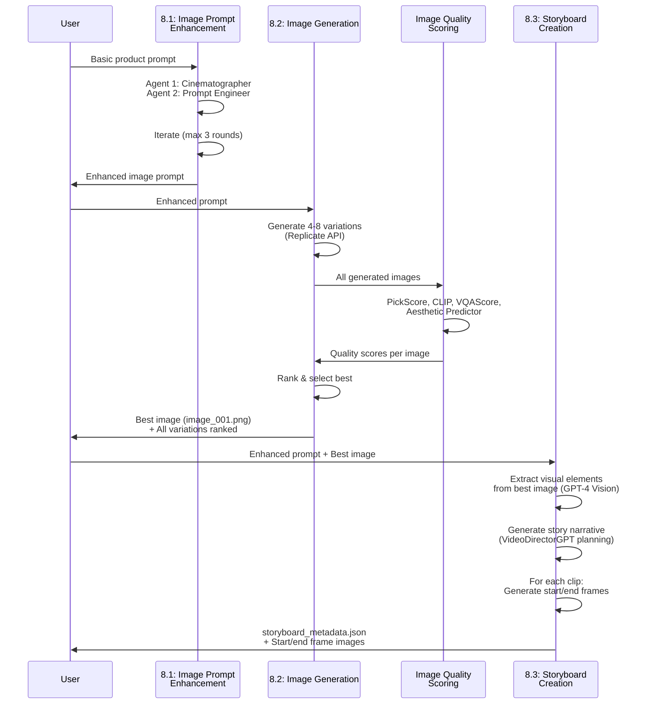
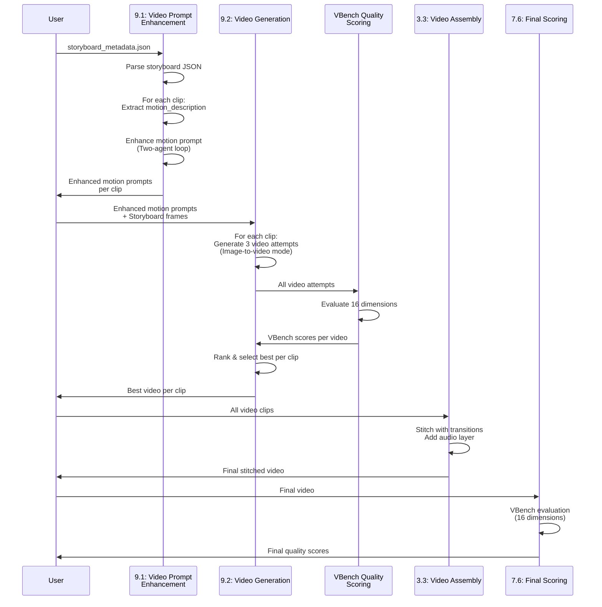

# Epic 8 & 9: Complete Architecture Flow Diagram

## Overview

This document visualizes the complete workflow from image prompt generation through final video assembly and scoring, showing how Epic 8 (Image Generation) and Epic 9 (Video Generation) work together.

## Complete Flow Architecture

```mermaid
flowchart TD
    Start([User Input:<br/>Product Description Prompt]) --> EP8_1[Epic 8.1: Image Prompt Enhancement]
    
    EP8_1 --> |Enhanced Image Prompt| EP8_2[Epic 8.2: Image Generation]
    EP8_2 --> |Generates 4-8 Variations| Score[Image Quality Scoring]
    Score --> |PickScore, CLIP, VQAScore, Aesthetic| Rank[Rank & Select Best Image]
    Rank --> |Best Image: image_001.png| BestImg[Best Image Candidate<br/>+ Metadata JSON]
    
    BestImg --> EP8_3[Epic 8.3: Storyboard Creation]
    EP8_1 -.-> |Enhanced Prompt| EP8_3
    
    EP8_3 --> |Uses Best Image as Reference| Extract[Extract Visual Elements<br/>from Best Image]
    Extract --> |Brand, Colors, Style| Plan[Generate Story Narrative<br/>VideoDirectorGPT Planning]
    Plan --> |3-5 Clips with Motion Descriptions| GenFrames[Generate Start/End Frames<br/>for Each Clip]
    GenFrames --> |clip_001_start.png<br/>clip_001_end.png<br/>...| Storyboard[Storyboard Output:<br/>storyboard_metadata.json<br/>+ Start/End Frame Images]
    
    Storyboard --> EP9_1[Epic 9.1: Video Prompt Enhancement]
    
    EP9_1 --> |Load storyboard_metadata.json| ParseStory[Parse Storyboard JSON]
    ParseStory --> |For Each Clip| EnhanceMotion[Enhance Motion Prompts<br/>Per Clip]
    EnhanceMotion --> |Two-Agent Loop| MotionPrompts[Enhanced Motion Prompts:<br/>clip_001_enhanced_motion_prompt.txt<br/>clip_002_enhanced_motion_prompt.txt<br/>...]
    
    MotionPrompts --> EP9_2[Epic 9.2: Video Generation]
    Storyboard -.-> |Start/End Frames| EP9_2
    
    EP9_2 --> |For Each Clip| GenVideos[Generate Video Clips<br/>Image-to-Video Mode]
    GenVideos --> |3 Attempts Per Clip| VBench[VBench Quality Scoring<br/>16 Dimensions]
    VBench --> |Rank by Quality| BestVideos[Best Video Per Clip<br/>video_001.mp4, video_002.mp4, ...]
    
    BestVideos --> EP3_3[Epic 3.3: Video Assembly]
    EP3_3 --> |Stitch Clips| Stitch[Concatenate with Transitions<br/>Add Audio Layer]
    Stitch --> |Final Video| FinalVideo[Final Stitched Video<br/>final_video.mp4]
    
    FinalVideo --> EP7_6[Story 7.6: Final VBench Scoring]
    EP7_6 --> |16 Dimensions| FinalScores[Final Video Quality Scores<br/>+ Overall Score]
    
    style Start fill:#e1f5ff
    style BestImg fill:#fff4e1
    style Storyboard fill:#fff4e1
    style MotionPrompts fill:#fff4e1
    style BestVideos fill:#fff4e1
    style FinalVideo fill:#e8f5e9
    style FinalScores fill:#e8f5e9
```



## Detailed Component Flow

### Phase 1: Image Generation (Epic 8)



### Phase 2: Video Generation (Epic 9)



## Data Flow & File Structure

### Input/Output Files at Each Stage

```
1. INPUT: product_prompt.txt
   ↓
2. EPIC 8.1 OUTPUT:
   output/image_prompt_traces/{timestamp}/
   ├── 00_original_prompt.txt
   ├── 05_final_enhanced_prompt.txt
   └── prompt_trace_summary.json
   ↓
3. EPIC 8.2 OUTPUT:
   output/image_generations/{timestamp}/
   ├── image_001.png (BEST - ranked #1)
   ├── image_002.png
   ├── ...
   ├── image_001_metadata.json
   └── generation_trace.json
   ↓
4. EPIC 8.3 OUTPUT:
   output/storyboards/{timestamp}/
   ├── clip_001_start.png
   ├── clip_001_end.png
   ├── clip_002_start.png
   ├── clip_002_end.png
   ├── clip_003_start.png
   ├── clip_003_end.png
   └── storyboard_metadata.json
       {
         "clips": [
           {
             "clip_number": 1,
             "motion_description": "Camera slowly pushes in...",
             "camera_movement": "Push in from wide to medium",
             "start_frame_path": "...",
             "end_frame_path": "..."
           },
           ...
         ]
       }
   ↓
5. EPIC 9.1 OUTPUT:
   output/video_prompt_traces/{timestamp}/
   ├── clip_001/
   │   ├── 00_original_motion.txt
   │   ├── 05_final_enhanced_motion_prompt.txt
   │   └── prompt_trace_summary.json
   ├── clip_002/
   │   └── ...
   ├── clip_001_enhanced_motion_prompt.txt
   ├── clip_002_enhanced_motion_prompt.txt
   └── storyboard_enhanced_motion_prompts.json
   ↓
6. EPIC 9.2 OUTPUT:
   output/video_generations/{timestamp}/
   ├── clip_001/
   │   ├── video_001.mp4 (BEST)
   │   ├── video_002.mp4
   │   ├── video_003.mp4
   │   └── video_001_metadata.json (VBench scores)
   ├── clip_002/
   │   └── ...
   └── generation_trace.json
   ↓
7. EPIC 3.3 OUTPUT:
   output/videos/{generation_id}/
   ├── final_video.mp4
   └── thumbnail.jpg
   ↓
8. STORY 7.6 OUTPUT:
   Quality scores stored in database
   + VBench evaluation results
```

## Key Integration Points

### 1. Best Image → Storyboard Narrative
- **Input**: `image_001.png` (best from 8.2) + enhanced prompt
- **Process**: GPT-4 Vision extracts visual elements (brand, colors, style)
- **Output**: Story narrative with visual coherence maintained

### 2. Storyboard → Motion Prompt Enhancement
- **Input**: `storyboard_metadata.json` with motion descriptions per clip
- **Process**: Two-agent enhancement loop per clip's motion_description
- **Output**: Enhanced motion prompts per clip

### 3. Enhanced Motion Prompts → Video Generation
- **Input**: Enhanced motion prompts + start/end frames from storyboard
- **Process**: Image-to-video generation (3 attempts per clip)
- **Output**: Best video per clip (ranked by VBench)

### 4. Video Clips → Final Assembly
- **Input**: All best video clips
- **Process**: Stitching with transitions + audio layer
- **Output**: Final stitched video

## Verification: Intent Capture

✅ **Your Desired Flow:**
1. Image prompt generation → initial best image ✅
2. Generate story narrative based on best image + original prompt ✅
3. Generate storyboard images ✅
4. Generate video prompt (enhance motion prompts) ✅
5. Generate video clips ✅
6. Assembly into one ✅
7. Final score of the final video ✅

**All steps are captured in the architecture!**

## Potential Gaps & Recommendations

### ✅ Working as Designed:
- Storyboard creation (8.3) accepts `--reference-image` to use best image from 8.2
- Storyboard service uses `enhance_storyboard_prompts` when reference image provided
- Video prompt enhancement (9.1) now accepts `--storyboard` to enhance motion prompts
- Video generation (9.2) accepts `--storyboard` to use start/end frames

### ⚠️ Manual Workflow (Currently):
The tools are separate CLI commands. For full automation, use:
- **Story 9.3** (`feedback_loop.py`) - Orchestrates complete workflow end-to-end

### 📝 Recommended Usage:

**Manual Step-by-Step:**
```bash
# Step 1: Enhance image prompt
python enhance_image_prompt.py product_prompt.txt

# Step 2: Generate images
python generate_images.py enhanced_prompt.txt

# Step 3: Create storyboard (with best image)
python create_storyboard.py enhanced_prompt.txt --reference-image output/image_generations/{timestamp}/image_001.png

# Step 4: Enhance video motion prompts
python enhance_video_prompt.py --storyboard output/storyboards/{timestamp}/storyboard_metadata.json

# Step 5: Generate videos
python generate_videos.py --storyboard output/storyboards/{timestamp}/storyboard_metadata.json

# Step 6: Assembly (existing Epic 3 service)
# Step 7: Final scoring (existing Story 7.6 service)
```

**Automated (Story 9.3):**
```bash
python feedback_loop.py product_prompt.txt --workflow full
```

