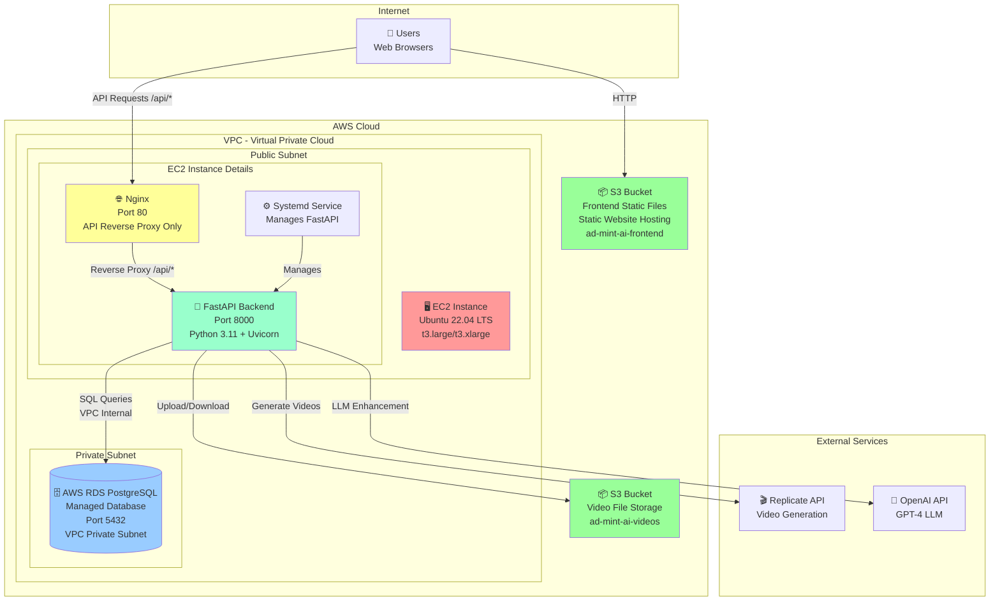

# AWS Deployment Architecture - Visual Diagram

## High-Level Architecture



## Detailed Component Layout

### Frontend Hosting (S3 Static Website)

```
┌─────────────────────────────────────────────────────────────┐
│              S3 Bucket: ad-mint-ai-frontend                  │
│              └─ Static Website Hosting Enabled               │
│              └─ Website Endpoint: ad-mint-ai-frontend.s3-website-<region>.amazonaws.com │
│                                                               │
│  Contents:                                                   │
│  ├─ index.html                                              │
│  ├─ assets/                                                 │
│  │   ├─ JS bundles (main.[hash].js)                         │
│  │   ├─ CSS files (main.[hash].css)                         │
│  │   └─ Images and other static assets                      │
│  └─ Deployed via CI/CD: npm run build → aws s3 sync         │
│                                                               │
│  Configuration:                                              │
│  ├─ Bucket Policy: Public read access                       │
│  ├─ CORS: Configured for API domain                           │
│  └─ Index Document: index.html                              │
└─────────────────────────────────────────────────────────────┘
```

### EC2 Instance Internal Structure (Backend Only)

```
┌─────────────────────────────────────────────────────────────┐
│                    EC2 Instance (Ubuntu 22.04)               │
│                  IP: 54.xxx.xxx.xxx (Public)                 │
│                  Private IP: 10.0.1.50                        │
│                                                               │
│  ┌──────────────────────────────────────────────────────┐  │
│  │  Nginx (Port 80) - System Service                     │  │
│  │  └─ Proxies: /api/* → http://127.0.0.1:8000          │  │
│  │     (No frontend serving - frontend on S3)            │  │
│  └──────────────────────────────────────────────────────┘  │
│                                                               │
│  ┌──────────────────────────────────────────────────────┐  │
│  │  FastAPI Backend (Port 8000)                         │  │
│  │  Location: /var/www/ad-mint-ai/backend/             │  │
│  │  ├─ Python 3.11 + Virtual Environment               │  │
│  │  ├─ FastAPI Application (app/main.py)               │  │
│  │  ├─ API Routes: /api/auth/*, /api/generate, etc.    │  │
│  │  ├─ Video Pipeline Services                         │  │
│  │  └─ Managed by: systemd (fastapi.service)            │  │
│  └──────────────────────────────────────────────────────┘  │
│                                                               │
│  ┌──────────────────────────────────────────────────────┐  │
│  │  Systemd Service                                     │  │
│  │  ├─ Service Name: fastapi                           │  │
│  │  ├─ Auto-restart: enabled                           │  │
│  │  ├─ Boot startup: enabled                            │  │
│  │  └─ Logs: journalctl -u fastapi                     │  │
│  └──────────────────────────────────────────────────────┘  │
│                                                               │
│  ┌──────────────────────────────────────────────────────┐  │
│  │  Environment Files                                   │  │
│  │  ├─ /var/www/ad-mint-ai/backend/.env                │  │
│  │  ├─ API keys, database passwords, JWT secret         │  │
│  │  └─ Proper file permissions (readable by app only)  │  │
│  └──────────────────────────────────────────────────────┘  │
│                                                               │
│  ┌──────────────────────────────────────────────────────┐  │
│  │  Log Files                                           │  │
│  │  ├─ FastAPI logs: /var/log/fastapi/app.log          │  │
│  │  ├─ Nginx access: /var/log/nginx/ad-mint-ai-access.log│
│  │  └─ Nginx error: /var/log/nginx/ad-mint-ai-error.log│
│  └──────────────────────────────────────────────────────┘  │
└─────────────────────────────────────────────────────────────┘
```

### Network Flow

```
User Request Flow:
┌─────────┐
│ Browser │
└────┬────┘
     │
     ├─ HTTP Request (Frontend)
     │  GET http://yourdomain.com
     │  ▼
     │  ┌─────────────────────────────┐
     │  │  S3 Bucket (Frontend)       │
     │  │  ad-mint-ai-frontend         │
     │  │  Static Website Hosting      │
     │  └─────────────────────────────┘
     │
     └─ API Request (Backend)
        GET http://yourdomain.com/api/*
        ▼
┌─────────────────────────────────────┐
│  AWS Security Group                  │
│  ├─ Inbound: Port 80 (HTTP)         │
│  ├─ Inbound: Port 22 (SSH)          │
│  └─ Outbound: All                   │
└──────────────┬──────────────────────┘
               │
               ▼
┌─────────────────────────────────────┐
│  EC2 Instance (Public IP)           │
│  ┌───────────────────────────────┐  │
│  │  Nginx (Port 80)              │  │
│  │  └─ /api/* → FastAPI:8000    │  │
│  └───────────────────────────────┘  │
└─────────────────────────────────────┘
               │
               ▼
         ┌─────────────────┐
         │  FastAPI:8000   │
         │  (localhost)    │
         └────────┬────────┘
                  │
                  ├─ Database Queries
                  │  │
                  │  ▼
                  │  ┌─────────────────────────────┐
                  │  │  RDS PostgreSQL (Private)   │
                  │  │  Endpoint: xxx.rds.amazonaws│
                  │  │  Port: 5432 (VPC Internal)  │
                  │  └─────────────────────────────┘
                  │
                  ├─ Video Storage
                  │  │
                  │  ▼
                  │  ┌─────────────────────────────┐
                  │  │  S3 Bucket                 │
                  │  │  ad-mint-ai-videos          │
                  │  └─────────────────────────────┘
                  │
                  └─ External APIs
                     │
                     ├─ Replicate API (Video Gen)
                     └─ OpenAI API (LLM)
```

## Component Locations Summary

| Component | Location | Details |
|-----------|----------|---------|
| **Frontend** | S3 Static Website | `ad-mint-ai-frontend` S3 bucket with static website hosting - Static React build files |
| **Backend** | EC2 Instance | `/var/www/ad-mint-ai/backend/` - FastAPI application running on port 8000 |
| **Database** | AWS RDS | Separate managed PostgreSQL instance in same VPC, private subnet |
| **Video Storage** | AWS S3 | `ad-mint-ai-videos` bucket - stores generated video files |
| **Environment Variables** | EC2 Instance | `.env` file on EC2 with proper permissions |
| **Logging** | EC2 Instance | Log files on EC2 with rotation configured |
| **Web Server** | EC2 Instance | Nginx on port 80, proxies API requests only (no frontend serving) |

## Security Groups Configuration

### EC2 Security Group (Public)
```
Inbound Rules:
├─ Port 80 (HTTP)   → 0.0.0.0/0 (Internet - for API requests)
├─ Port 22 (SSH)    → Your IP only
└─ Port 8000        → 127.0.0.1 (localhost only)

Outbound Rules:
└─ All traffic      → 0.0.0.0/0
```

### S3 Frontend Bucket Configuration
```
- Static website hosting enabled
- Bucket policy: Public read access
- CORS: Configured to allow API domain
- Index document: index.html
- Error document: index.html (for SPA routing)
- Website endpoint: ad-mint-ai-frontend.s3-website-<region>.amazonaws.com
```

### RDS Security Group (Private)
```
Inbound Rules:
└─ Port 5432 (PostgreSQL) → EC2 Security Group only

Outbound Rules:
└─ None (RDS doesn't initiate connections)
```

## VPC Layout

```
┌─────────────────────────────────────────────────────────┐
│                    AWS VPC                              │
│              CIDR: 10.0.0.0/16                          │
│                                                         │
│  ┌──────────────────────────────────────────────────┐  │
│  │  Public Subnet (10.0.1.0/24)                    │  │
│  │  ┌──────────────────────────────────────────┐  │  │
│  │  │  EC2 Instance                             │  │  │
│  │  │  Private IP: 10.0.1.50                    │  │  │
│  │  │  Public IP: 54.xxx.xxx.xxx                 │  │  │
│  │  │  Internet Gateway attached                │  │  │
│  │  └──────────────────────────────────────────┘  │  │
│  └──────────────────────────────────────────────────┘  │
│                                                         │
│  ┌──────────────────────────────────────────────────┐  │
│  │  Private Subnet (10.0.2.0/24)                  │  │
│  │  ┌──────────────────────────────────────────┐  │  │
│  │  │  RDS PostgreSQL                           │  │  │
│  │  │  Private IP: 10.0.2.100                   │  │  │
│  │  │  Endpoint: xxx.rds.amazonaws.com          │  │  │
│  │  │  No public IP (private only)               │  │  │
│  │  └──────────────────────────────────────────┘  │  │
│  └──────────────────────────────────────────────────┘  │
│                                                         │
│  External Services (Outside VPC):                      │
│  ├─ S3 (Internet endpoint)                             │
│  ├─ Replicate API (Internet)                            │
│  └─ OpenAI API (Internet)                               │
└─────────────────────────────────────────────────────────┘
```

## Data Flow Examples

### User Login Flow
```
1. User → HTTP → S3 Website Endpoint (loads React app)
2. React app → API Request → Nginx (Port 80) → FastAPI /api/auth/login
3. FastAPI → Query → RDS PostgreSQL (check credentials)
4. FastAPI → Generate JWT → Return to User (via Nginx)
```

### Video Generation Flow
```
1. User (React app on S3) → API Request → Nginx → FastAPI /api/generate
2. FastAPI → OpenAI API (LLM enhancement)
3. FastAPI → Replicate API (generate video clips)
4. FastAPI → Process videos (MoviePy)
5. FastAPI → Upload → S3 Video Bucket
6. FastAPI → Update → RDS (save metadata)
7. FastAPI → Return status → User (via Nginx)
```

### Video Download Flow
```
1. User (React app on S3) → API Request → Nginx → FastAPI /api/video/{id}
2. FastAPI → Query → RDS (get video metadata)
3. FastAPI → Download → S3 Video Bucket
4. FastAPI → Stream → Nginx → User
```

## Key Points

✅ **Frontend**: Static React files on S3 with static website hosting (simple, scalable, cost-effective)  
✅ **Backend**: FastAPI on EC2, port 8000 (localhost)  
✅ **Database**: AWS RDS PostgreSQL in private subnet, same VPC  
✅ **Storage**: AWS S3 for video files (not on EC2 disk)  
✅ **Environment Variables**: `.env` file on EC2 with proper permissions  
✅ **Logging**: Log files on EC2 with rotation configured  
✅ **Network**: EC2 in public subnet, RDS in private subnet  
✅ **Security**: RDS only accessible from EC2, no public access  

