# Master Mode Video Generation Pipeline

## Overview

Master Mode transforms a simple user prompt and reference images into a complete, professional advertisement video. This document explains the step-by-step journey from user input to final video output.

---

## Summary: Why This Works

### Quality Through Iteration
Each phase has multiple iterations with AI critics providing feedback. This ensures high-quality output even if the first attempt isn't perfect.

### Consistency Through Vision Analysis
Reference images define exact appearance once at the start. All agents reference these descriptions, ensuring the SAME person and product appear in every scene.

### Cohesion Through Multi-Agent Review
Separate agents check individual quality (Story Critic, Scene Critic) and cross-element consistency (Scene Cohesor, Scene Aligner). This catches issues early.

### Total Processing Time
- Story Generation: ~1-2 minutes
- Scene Generation: ~2-3 minutes (3 scenes)
- Video Parameter Enhancement: ~30 seconds
- Video Generation (Veo 3.1): ~2-3 minutes
- Video Stitching: ~30 seconds

**Total:** ~6-9 minutes for complete video generation

---

**Last Updated:** November 24, 2025  
**System Status:** ✅ Production Ready

```mermaid
flowchart TD
    Start([User Submits Request]) --> Upload[Upload Reference Images]
    Upload --> Vision[Vision Analysis Agent]
    Vision --> |Extract Character/Product Details| StoryGen[Story Generation Phase]
    
    subgraph Story["📖 Story Generation (Iterative)"]
        StoryGen --> Director1[Story Director Agent]
        Director1 --> |Generates Story Draft| Critic1[Story Critic Agent]
        Critic1 --> |Score & Feedback| Decision1{Score ≥ 85?}
        Decision1 --> |No & Iter < 3| Director2[Story Director<br/>Revision]
        Director2 --> Critic2[Story Critic]
        Critic2 --> Decision1
        Decision1 --> |Yes or Max Iter| FinalStory[Final Story]
    end
    
    FinalStory --> SceneGen[Scene Generation Phase]
    
    subgraph Scenes["🎬 Scene Generation (Per Scene)"]
        SceneGen --> Writer1[Scene Writer Agent]
        Writer1 --> |Writes Scene| SceneCritic1[Scene Critic Agent]
        SceneCritic1 --> |Score & Feedback| Decision2{Score ≥ 85?}
        Decision2 --> |No & Iter < 3| Writer2[Scene Writer<br/>Revision]
        Writer2 --> SceneCritic2[Scene Critic]
        SceneCritic2 --> Decision2
        Decision2 --> |Yes or Max Iter| NextScene{More Scenes?}
        NextScene --> |Yes| Writer1
        NextScene --> |No| Cohesor[Scene Cohesor Agent]
    end
    
    Cohesor --> |Check Cohesion| Decision3{Cohesion ≥ 85?}
    Decision3 --> |No & Iter < 2| Writer1
    Decision3 --> |Yes| VideoParams[Video Preparation]
    
    subgraph Enhancement["🎨 Video Parameter Enhancement"]
        VideoParams --> Enhancer[Scene Enhancer Agent]
        Enhancer --> |Optimize for Veo 3.1| Aligner[Scene Aligner Agent]
        Aligner --> |Visual Consistency| Sanitizer[Appearance Sanitizer]
        Sanitizer --> |Remove Redundancies| Enhanced[Enhanced Parameters]
    end
    
    Enhanced --> VideoGen[🎥 Video Generation<br/>Veo 3.1 API]
    VideoGen --> |Generate Scene Videos| Stitcher[Video Stitcher]
    Stitcher --> |Apply Transitions| Final[Final Video]
    Final --> S3[☁️ Upload to S3]
    S3 --> Complete([✅ Complete])
    
    style Director1 fill:#e1f5ff
    style Critic1 fill:#fff3e0
    style Writer1 fill:#e1f5ff
    style SceneCritic1 fill:#fff3e0
    style Cohesor fill:#f3e5f5
    style Enhancer fill:#e8f5e9
    style Aligner fill:#e8f5e9
    style Sanitizer fill:#e8f5e9
    style Stitcher fill:#fce4ec
```

## The Journey: From Prompt to Video

### Step 1: User Submits Request
**What happens:** User provides a text prompt (e.g., "Create a luxury perfume ad") and uploads 1-3 reference images  
**Example Input:**
- Prompt: "A young professional discovers confidence through Royal perfume"
- Images: Photo of person, photo of perfume bottle
- Brand name: "Royal"

### Step 2: Upload Reference Images
**What happens:** System saves uploaded images and prepares them for analysis  
**Purpose:** These images define the exact people and products that will appear in the video

### Step 3: Vision Analysis Agent
**What happens:** AI analyzes reference images and extracts detailed descriptions  
**Output:**
- Character description: Age, height, hair color, facial features, clothing (forensic detail)
- Product description: Size, shape, colors, materials, branding, unique features  
**Purpose:** These descriptions ensure the SAME person and SAME product appear consistently in every scene

---

## Story Generation Phase (Iterative Loop)

### Step 4: Story Director Agent
**What happens:** Creates a comprehensive advertisement story (1500-2500 words)  
**Includes:**
- Complete narrative arc (AIDA: Attention, Interest, Desire, Action)
- Character details (using vision analysis)
- Product details (using vision analysis)
- Scene-by-scene breakdown
- Emotional beats and key moments

**Example Output:** 3-scene story where character discovers perfume, uses it authentically, gains confidence

### Step 5: Story Critic Agent
**What happens:** Evaluates the story and assigns a quality score (0-100)  
**Checks:**
- Is the narrative compelling?
- Does it follow AIDA framework?
- Are character/product details consistent?
- Is brand messaging clear?

**Output:** Score + detailed feedback on what needs improvement

### Step 6: Decision Point - Story Quality
**Question:** Is the score ≥ 85?

**If YES or reached 3 iterations:** Move to Scene Generation  
**If NO and < 3 iterations:** Story Director creates revised version using critic's feedback, then Critic re-evaluates

**Result:** Final story approved (even if not perfect, max 3 iterations ensures progress)

---

## Scene Generation Phase (Per-Scene Iterative Loop)

### Step 7: Scene Writer Agent
**What happens:** For each scene in the story, writes detailed scene description  
**Includes:**
- Environment details (location, lighting, atmosphere)
- Character actions (what they do, step-by-step)
- Camera work (angles, movements, framing)
- Visual elements (colors, composition, focus)
- Timing and pacing (4-8 seconds per scene)

**Example:** "Scene 1: Close-up of the EXACT SAME person from reference image in elegant room, soft golden lighting from left, camera slowly pushes in, character reaches for perfume bottle..."

### Step 8: Scene Critic Agent
**What happens:** Evaluates each scene individually  
**Checks:**
- Are visual details specific enough?
- Is the action clear and realistic?
- Does camera work enhance the story?
- Is it consistent with the overall story?

**Output:** Score + feedback for this specific scene

### Step 9: Decision Point - Scene Quality
**Question:** Is the score ≥ 85?

**If YES or reached 3 iterations:** Move to next scene  
**If NO and < 3 iterations:** Scene Writer revises this scene, Critic re-evaluates

### Step 10: Next Scene Check
**Question:** Are there more scenes to write?

**If YES:** Return to Scene Writer for next scene  
**If NO:** All scenes written, move to Scene Cohesor

---

## Cohesion Review Phase

### Step 11: Scene Cohesor Agent
**What happens:** Reviews ALL scenes together as a complete video  
**Checks:**
- Do scenes flow naturally from one to another?
- Is the narrative progression logical?
- Are characters/products consistent across ALL scenes?
- Do transitions make sense?
- Is the emotional arc smooth?

**Output:** Cohesion score (0-100) + feedback on cross-scene issues

### Step 12: Decision Point - Cohesion Quality
**Question:** Is cohesion score ≥ 85?

**If YES or reached 2 iterations:** Move to Video Preparation  
**If NO and < 2 iterations:** Return to Scene Writer to revise problematic scenes

---

## Video Parameter Enhancement Phase

### Step 13: Scene Enhancer Agent
**What happens:** Optimizes each scene specifically for Veo 3.1 video generation AI  
**Process:**
- Expands scenes to 300-500 words with cinematic detail
- Adds Veo 3.1-specific optimizations (camera movements, lighting, effects)
- Maintains character/product consistency using vision analysis

**Example:** Transforms "character picks up bottle" into detailed prompt about hand movement, bottle reflection, lighting changes, camera focus shifts

### Step 14: Scene Aligner Agent
**What happens:** Ensures visual consistency across all enhanced scenes  
**Checks:**
- Same lighting style in all scenes
- Consistent color palette
- Matching camera style
- Coherent visual mood

**Output:** Aligned scenes with unified visual language

### Step 15: Appearance Sanitizer Agent
**What happens:** Removes character/product appearance descriptions from prompts  
**Why:** Reference images will define appearance, so text descriptions would conflict  
**Process:** Keeps actions, camera work, lighting, but removes physical descriptions

**Example:** Changes "brown-haired woman in white dress picks up bottle" to "person picks up bottle" (reference image shows the woman)

### Step 16: Enhanced Video Parameters Ready
**Output:** Production-ready parameters for each scene video:
- Optimized prompt (300-500 words)
- Reference images attached
- Duration (4-8 seconds)
- Resolution (1080p, 16:9)
- Transition type (crossfade, cut, flash, etc.)

---

## Video Generation & Assembly Phase

### Step 17: Video Generation (Veo 3.1 API)
**What happens:** Google Veo 3.1 generates actual video for each scene  
**Process:**
- Each scene generated in parallel (up to 4 at once)
- Reference images used to maintain consistent appearance
- Enhanced prompts guide camera work and action
- Takes ~30-60 seconds per scene

**Output:** Individual MP4 videos for each scene (e.g., scene_01.mp4, scene_02.mp4, scene_03.mp4)

### Step 18: Video Stitcher
**What happens:** Combines individual scene videos into final advertisement  
**Process:**
1. Loads all scene videos
2. Applies intro fade (0.3s)
3. Applies transitions between scenes (crossfade, cut, flash, etc.)
4. Applies outro fade (0.3s)
5. Concatenates everything together
6. Exports final video

**Output:** Single polished video file (12-20 seconds total)

### Step 19: Upload to S3
**What happens:** Final video uploaded to AWS S3 storage  
**Purpose:** Makes video accessible via URL for frontend to display

### Step 20: Complete ✅
**Output:** Video URL returned to user  
**User Experience:** User sees their complete, professional advertisement video ready to download/share

---

