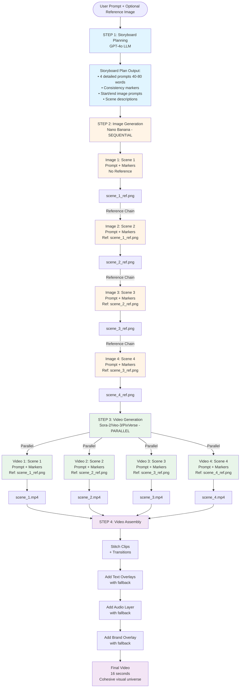
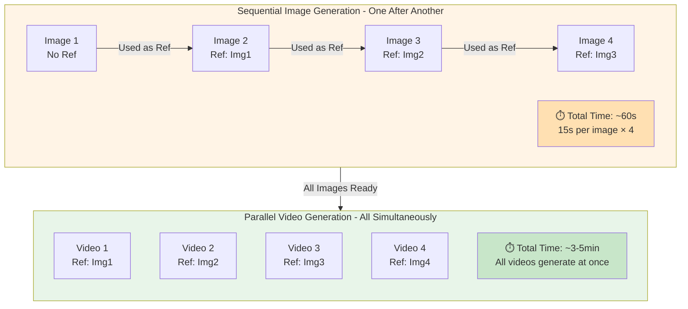

# Storyboard Generation Flow - Visualization

## Complete Workflow Visualization

### High-Level Workflow



### Detailed Image & Video Generation Flow

```mermaid
flowchart LR
    subgraph Phase1["Phase 1: Storyboard Planning"]
        Prompt[User Prompt] --> LLM[GPT-4o LLM]
        LLM --> Markers["Consistency Markers:<br/>style, color, lighting,<br/>composition, mood"]
        LLM --> Prompts["4 Detailed Prompts<br/>40-80 words each"]
    end
    
    subgraph Phase2["Phase 2: Sequential Image Generation"]
        direction TB
        Markers --> Img1["Image 1 Generation<br/>Nano Banana<br/>Prompt 1 + Markers<br/>No Reference"]
        Img1 --> Img1File[scene_1_ref.png]
        
        Img1File --> Img2["Image 2 Generation<br/>Nano Banana<br/>Prompt 2 + Markers<br/>Reference: Img1"]
        Img2 --> Img2File[scene_2_ref.png]
        
        Img2File --> Img3["Image 3 Generation<br/>Nano Banana<br/>Prompt 3 + Markers<br/>Reference: Img2"]
        Img3 --> Img3File[scene_3_ref.png]
        
        Img3File --> Img4["Image 4 Generation<br/>Nano Banana<br/>Prompt 4 + Markers<br/>Reference: Img3"]
        Img4 --> Img4File[scene_4_ref.png]
    end
    
    subgraph Phase3["Phase 3: Parallel Video Generation"]
        direction TB
        Prompts --> VideoGen[Video Generation Starts]
        Markers --> VideoGen
        Img1File --> VideoGen
        Img2File --> VideoGen
        Img3File --> VideoGen
        Img4File --> VideoGen
        
        VideoGen -->|Parallel| V1["Video 1: Kling 2.5 Turbo Pro<br/>Prompt 1 + Markers<br/>Start: scene_1_start.png (UNIQUE frame)<br/>End: scene_1_end.png (UNIQUE frame)<br/>Ref: scene_1_ref.png (style only)"]
        VideoGen -->|Parallel| V2["Video 2: Kling 2.5 Turbo Pro<br/>Prompt 2 + Markers<br/>Start: scene_2_start.png (DIFFERENT frame)<br/>End: scene_2_end.png (DIFFERENT frame)<br/>Ref: scene_2_ref.png (style only)"]
        VideoGen -->|Parallel| V3["Video 3: Kling 2.5 Turbo Pro<br/>Prompt 3 + Markers<br/>Start: scene_3_start.png (DIFFERENT frame)<br/>End: scene_3_end.png (DIFFERENT frame)<br/>Ref: scene_3_ref.png (style only)"]
        VideoGen -->|Parallel| V4["Video 4: Kling 2.5 Turbo Pro<br/>Prompt 4 + Markers<br/>Start: scene_4_start.png (DIFFERENT frame)<br/>End: scene_4_end.png (DIFFERENT frame)<br/>Ref: scene_4_ref.png (style only)"]
        
        V1 --> V1File[scene_1.mp4]
        V2 --> V2File[scene_2.mp4]
        V3 --> V3File[scene_3.mp4]
        V4 --> V4File[scene_4.mp4]
    end
    
    subgraph Phase4["Phase 4: Final Assembly"]
        V1File --> Assembly[Stitch All Clips]
        V2File --> Assembly
        V3File --> Assembly
        V4File --> Assembly
        
        Assembly --> Overlay[Add Text Overlays]
        Overlay --> AudioLayer[Add Audio]
        AudioLayer --> BrandOverlay[Add Brand Overlay]
        BrandOverlay --> FinalVideo[Final Video]
    end
    
    Phase1 --> Phase2
    Phase2 --> Phase3
    Phase3 --> Phase4
    
    style Phase1 fill:#e1f5ff
    style Phase2 fill:#fff4e6
    style Phase3 fill:#e8f5e9
    style Phase4 fill:#f3e5f5
    style Markers fill:#ffe0b2
    style Prompts fill:#ffe0b2
```



### Sequential vs Parallel Visualization



## Detailed Storyboard Structure

### Phase 1: Detailed Storyboard Planning (One-Time)

```
┌─────────────────────────────────────────────────────────┐
│  User Prompt: "Create an ad for a fitness app"          │
│  + Optional Reference Image                             │
└─────────────────────────────────────────────────────────┘
                        ↓
┌─────────────────────────────────────────────────────────┐
│  LLM (GPT-4o) Plans Detailed Storyboard                 │
│  ┌───────────────────────────────────────────────────┐ │
│  │ Creates 4 detailed prompts (40-80 words each)    │ │
│  │ Each prompt includes:                             │ │
│  │ - Rich visual details                             │ │
│  │ - Specific composition and framing                │ │
│  │ - Clear character/product actions                 │ │
│  │ - Environment descriptions                        │ │
│  │                                                    │ │
│  │ Generates Consistency Markers:                     │ │
│  │ - style: "dynamic modern minimalist"              │ │
│  │ - color_palette: "vibrant primary colors"         │ │
│  │ - lighting: "bright natural daylight"             │ │
│  │ - composition: "dynamic angles"                   │ │
│  │ - mood: "energetic optimistic"                    │ │
│  └───────────────────────────────────────────────────┘ │
└─────────────────────────────────────────────────────────┘
                        ↓
┌─────────────────────────────────────────────────────────┐
│  Storyboard Plan Stored:                                │
│  - Detailed prompts for each scene                     │
│  - Consistency markers                                  │
│  - Scene descriptions                                   │
│  (Used for both image and video generation)             │
└─────────────────────────────────────────────────────────┘
```

### Phase 2: Image Generation (Sequential with References)

```
┌─────────────────────────────────────────────────────────────┐
│  IMAGE 1: Scene 1 - Attention                               │
│  ┌───────────────────────────────────────────────────────┐  │
│  │ Detailed Prompt: "A young professional jogging through│  │
│  │ a sunlit park in the morning, dynamic camera angle    │  │
│  │ following their movement, vibrant colors, energetic    │  │
│  │ atmosphere..." (40-80 words from storyboard)          │  │
│  │ + Consistency Markers                                  │  │
│  │ Reference: None (first image)                         │  │
│  │ Model: Nano Banana                                    │  │
│  └───────────────────────────────────────────────────────┘  │
│  Output: scene_1.png                                       │
└─────────────────────────────────────────────────────────────┘
                        ↓
┌─────────────────────────────────────────────────────────────┐
│  IMAGE 2: Scene 2 - Interest                               │
│  ┌───────────────────────────────────────────────────────┐  │
│  │ Detailed Prompt: "The same person checking their     │  │
│  │ phone while jogging, close-up shot showing the        │  │
│  │ fitness app interface, rule of thirds composition..." │  │
│  │ + Consistency Markers                                  │  │
│  │ Reference: scene_1.png ← Visual consistency!          │  │
│  │ Model: Nano Banana                                    │  │
│  └───────────────────────────────────────────────────────┘  │
│  Output: scene_2.png                                       │
└─────────────────────────────────────────────────────────────┘
                        ↓
┌─────────────────────────────────────────────────────────────┐
│  IMAGE 3: Scene 3 - Desire                                 │
│  ┌───────────────────────────────────────────────────────┐  │
│  │ Detailed Prompt: "The same person at a modern gym,    │  │
│  │ using fitness equipment, wide angle showing the      │  │
│  │ environment, maintaining visual style..."             │  │
│  │ + Consistency Markers                                  │  │
│  │ Reference: scene_2.png ← Visual consistency!         │  │
│  │ Model: Nano Banana                                    │  │
│  └───────────────────────────────────────────────────────┘  │
│  Output: scene_3.png                                       │
└─────────────────────────────────────────────────────────────┘
                        ↓
┌─────────────────────────────────────────────────────────────┐
│  IMAGE 4: Scene 4 - Action                                 │
│  ┌───────────────────────────────────────────────────────┐  │
│  │ Detailed Prompt: "The same person celebrating their   │  │
│  │ fitness achievement, close-up with dynamic framing,   │  │
│  │ maintaining character consistency..."                 │  │
│  │ + Consistency Markers                                  │  │
│  │ Reference: scene_3.png ← Visual consistency!          │  │
│  │ Model: Nano Banana                                    │  │
│  └───────────────────────────────────────────────────────┘  │
│  Output: scene_4.png                                       │
└─────────────────────────────────────────────────────────────┘
```

### Phase 3: Video Generation (Parallel with Start/End Images)

**IMPORTANT**: For Kling 2.5 Turbo Pro (default model), each scene uses:
- **Start Image**: Controls the FIRST FRAME (UNIQUE per scene - different starting moment)
- **End Image**: Controls the LAST FRAME (UNIQUE per scene - different ending moment)
- **Reference Image**: For style/character consistency (shared subject/style, but doesn't override frames)

```
┌─────────────────────────────────────────────────────────────┐
│  VIDEO 1: Scene 1 - Attention (4 seconds)                  │
│  ┌───────────────────────────────────────────────────────┐  │
│  │ Detailed Prompt: "A young professional jogging through│  │
│  │ a sunlit park in the morning, dynamic camera angle    │  │
│  │ following their movement, vibrant colors, energetic   │  │
│  │ atmosphere..." (from storyboard)                      │  │
│  │ + Consistency Markers                                  │  │
│  │ Start Image: scene_1_start.png (UNIQUE first frame)   │  │
│  │ End Image: scene_1_end.png (UNIQUE last frame)        │  │
│  │ Reference: scene_1_ref.png (style consistency only)   │  │
│  │ Model: Kling 2.5 Turbo Pro (default)                 │  │
│  └───────────────────────────────────────────────────────┘  │
│  Output: scene_1.mp4                                       │
└─────────────────────────────────────────────────────────────┘

┌─────────────────────────────────────────────────────────────┐
│  VIDEO 2: Scene 2 - Interest (4 seconds)                    │
│  ┌───────────────────────────────────────────────────────┐  │
│  │ Detailed Prompt: "The same person checking their      │  │
│  │ phone while jogging, close-up shot showing the        │  │
│  │ fitness app interface, rule of thirds composition..." │  │
│  │ + Consistency Markers                                  │  │
│  │ Start Image: scene_2_start.png (DIFFERENT first frame) │  │
│  │ End Image: scene_2_end.png (DIFFERENT last frame)     │  │
│  │ Reference: scene_2_ref.png (style consistency only)   │  │
│  │ Model: Kling 2.5 Turbo Pro (default)                 │  │
│  └───────────────────────────────────────────────────────┘  │
│  Output: scene_2.mp4                                       │
└─────────────────────────────────────────────────────────────┘

┌─────────────────────────────────────────────────────────────┐
│  VIDEO 3: Scene 3 - Desire (4 seconds)                     │
│  ┌───────────────────────────────────────────────────────┐  │
│  │ Detailed Prompt: "The same person at a modern gym,    │  │
│  │ using fitness equipment, wide angle showing the        │  │
│  │ environment, maintaining visual style..."              │  │
│  │ + Consistency Markers                                  │  │
│  │ Start Image: scene_3_start.png (DIFFERENT first frame) │  │
│  │ End Image: scene_3_end.png (DIFFERENT last frame)     │  │
│  │ Reference: scene_3_ref.png (style consistency only)   │  │
│  │ Model: Kling 2.5 Turbo Pro (default)                 │  │
│  └───────────────────────────────────────────────────────┘  │
│  Output: scene_3.mp4                                       │
└─────────────────────────────────────────────────────────────┘

┌─────────────────────────────────────────────────────────────┐
│  VIDEO 4: Scene 4 - Action (4 seconds)                     │
│  ┌───────────────────────────────────────────────────────┐  │
│  │ Detailed Prompt: "The same person celebrating their   │  │
│  │ fitness achievement, close-up with dynamic framing,    │  │
│  │ maintaining character consistency..."                  │  │
│  │ + Consistency Markers                                  │  │
│  │ Reference: scene_4.png (generated reference image)    │  │
│  │ Model: Sora-2 / Veo-3 / PixVerse                      │  │
│  └───────────────────────────────────────────────────────┘  │
│  Output: scene_4.mp4                                       │
└─────────────────────────────────────────────────────────────┘
```

### Phase 4: Final Assembly

```
┌─────────────────────────────────────────────────────────────┐
│  Video Assembly                                             │
│  ┌───────────────────────────────────────────────────────┐ │
│  │ scene_1.mp4 (4s) → scene_2.mp4 (4s) →                │ │
│  │ scene_3.mp4 (4s) → scene_4.mp4 (4s)                 │ │
│  └───────────────────────────────────────────────────────┘ │
│  ┌───────────────────────────────────────────────────────┐ │
│  │ Step 1: Stitch clips with transitions                 │ │
│  │ Step 2: Add text overlays (optional, with fallback)   │ │
│  │ Step 3: Add audio layer (optional, with fallback)     │ │
│  │ Step 4: Add brand overlay (optional, with fallback)  │ │
│  │   - Extract brand name from prompt                    │ │
│  │   - Display centered with background                 │ │
│  │   - Last 2 seconds of video                          │ │
│  └───────────────────────────────────────────────────────┘ │
└─────────────────────────────────────────────────────────────┘
                        ↓
┌─────────────────────────────────────────────────────────────┐
│  🎥 FINAL VIDEO (16 seconds)                                │
│  ✅ Cohesive visual universe                                │
│  ✅ Consistent style, colors, lighting                      │
│  ✅ Same character/product across scenes                    │
│  ✅ Professional ad quality                                 │
│  ✅ Brand overlay at end (if brand detected)                │
└─────────────────────────────────────────────────────────────┘
```

#### Brand Overlay Details

The brand overlay is automatically added at the end of the video if a brand name is detected in the user prompt:

- **Extraction**: Checks for common brand names (Nike, Adidas, Apple, etc.) or capitalized words
- **Display**: 
  - Semi-transparent black background (70% opacity)
  - White text, uppercase, 72px font
  - Centered on screen
  - Fade-in animation
  - Appears for last 2 seconds
- **Error Handling**: If overlay fails, video continues without it (logged as warning)

## Consistency Chain Visualization

```
Text Markers (Shared)
┌─────────────────────────────────────────┐
│ style: dynamic modern minimalist         │
│ color: vibrant primary colors            │
│ lighting: bright natural daylight        │
│ composition: dynamic angles              │
│ mood: energetic optimistic               │
└─────────────────────────────────────────┘
         ↓ Applied to ALL
    ┌────┴────┬────┬────┐
    ↓         ↓    ↓    ↓
Image 1   Image 2 Image 3 Image 4
(no ref)  (ref:1) (ref:2) (ref:3)
    ↓         ↓    ↓    ↓
Video 1   Video 2 Video 3 Video 4
(ref:1)   (ref:2) (ref:3) (ref:4)
```

## Key Features

1. **Single Marker Generation**: Markers created once, used everywhere
2. **Sequential Image Chain**: Each image references the previous one
3. **Parallel Video Generation**: All videos generated simultaneously
4. **Dual Consistency**: Text markers + visual references
5. **AIDA Framework**: Attention → Interest → Desire → Action
6. **Brand Overlay**: Automatic brand name extraction and overlay at video end
7. **Resilient Error Handling**: Optional enhancements (overlays, audio, brand) don't fail generation

## Timeline

```
Time 0s:    Generate Markers (1 LLM call)
Time 5s:    Generate Image 1 (Nano Banana)
Time 15s:   Generate Image 2 (Nano Banana + Image 1 ref)
Time 25s:   Generate Image 3 (Nano Banana + Image 2 ref)
Time 35s:   Generate Image 4 (Nano Banana + Image 3 ref)
Time 45s:   Generate Videos 1-4 in parallel (Sora-2, ~2-5 min each)
Time 5-10m: Video Assembly
            - Stitch clips
            - Add text overlays (with error handling)
            - Add audio layer (with error handling)
            - Add brand overlay (with error handling)
Time 10m:   ✅ Final Video Ready
```

## Storyboard Visualizer UI

The frontend includes a **Storyboard Visualizer** component that displays the storyboard plan in real-time during video generation.

### Features

- **Real-time Display**: Shows storyboard as soon as it's generated
- **Visual Storyboard**: Displays all generated images (reference, start, end) for each scene
- **Consistency Markers**: Shows style, color palette, lighting, composition, and mood
- **Scene Details**: Displays detailed prompts, scene descriptions, and AIDA stages
- **Kling 2.5 Turbo Pro Support**: Shows start and end frame images when using Kling 2.5 Turbo Pro

### UI Components

The visualizer appears automatically on the Dashboard when:
- A generation is in progress (`status: "processing"`)
- Storyboard plan data is available
- Images have been generated

### Display Structure

```
┌─────────────────────────────────────────────────────────┐
│  Storyboard                                             │
├─────────────────────────────────────────────────────────┤
│  Original Prompt: "Create an ad for a fitness app"     │
├─────────────────────────────────────────────────────────┤
│  Visual Consistency                                     │
│  ┌───────────────────────────────────────────────────┐  │
│  │ Style: dynamic modern minimalist                  │  │
│  │ Color Palette: vibrant primary colors             │  │
│  │ Lighting: bright natural daylight                 │  │
│  │ Composition: dynamic angles                       │  │
│  │ Mood: energetic optimistic                        │  │
│  └───────────────────────────────────────────────────┘  │
├─────────────────────────────────────────────────────────┤
│  Scene 1: Attention                                    │
│  ┌──────────┬──────────┬──────────┐                  │
│  │ Reference│  Start   │   End    │                  │
│  │  Image   │  Frame   │  Frame   │                  │
│  └──────────┴──────────┴──────────┘                  │
│  Story: "A young professional jogging through..."      │
│  Environment: Sunlit park                              │
│  Action: Jogging with dynamic camera movement          │
│  Camera: Following shot, rule of thirds               │
└─────────────────────────────────────────────────────────┘
```

### API Integration

The storyboard data is returned via the status endpoint:

```typescript
GET /api/status/{generation_id}

Response:
{
  "generation_id": "...",
  "status": "processing",
  "progress": 25,
  "storyboard_plan": {
    "consistency_markers": {...},
    "scenes": [
      {
        "scene_number": 1,
        "aida_stage": "Attention",
        "detailed_prompt": "...",
        "reference_image_url": "http://...",
        "start_image_url": "http://...",  // For Kling 2.5 Turbo Pro
        "end_image_url": "http://...",     // For Kling 2.5 Turbo Pro
        ...
      }
    ]
  }
}
```

### Component Location

- **Frontend**: `frontend/src/components/storyboard/StoryboardVisualizer.tsx`
- **Integration**: `frontend/src/routes/Dashboard.tsx`
- **API**: `backend/app/api/routes/generations.py` (status endpoint)

## Image Generation Prompts Display

### Overview

The storyboard visualizer now displays the actual prompts used to generate each image, showing users exactly what text was sent to the image generation model.

### Display Structure

For each scene, three types of images are displayed:

1. **Reference Image**
   - Shows the reference image for the scene
   - Displays `reference_image_prompt` (enhanced prompt with consistency markers)
   - Falls back to `detailed_prompt` if enhanced prompt not available

2. **Start Frame Image** (for Kling 2.5 Turbo Pro)
   - Shows the first frame image
   - Displays `start_image_enhanced_prompt` (enhanced prompt with consistency markers)
   - Falls back to `start_image_prompt` if enhanced prompt not available

3. **End Frame Image** (for Kling 2.5 Turbo Pro)
   - Shows the last frame image
   - Displays `end_image_enhanced_prompt` (enhanced prompt with consistency markers)
   - Falls back to `end_image_prompt` if enhanced prompt not available

### Enhanced Prompts

Enhanced prompts include the base prompt plus consistency markers:

**Example**:
```
Base Prompt: "A young professional jogging through a sunlit park in the morning, dynamic camera angle following their movement..."

Enhanced Prompt: "A young professional jogging through a sunlit park in the morning, dynamic camera angle following their movement. Style: dynamic modern minimalist, Color palette: vibrant primary colors, Lighting: bright natural daylight, Composition: dynamic angles with rule of thirds, Mood: energetic optimistic"
```

### Technical Implementation

**Backend Storage**:
- Enhanced prompts are generated using `_build_prompt_with_markers()` function
- Stored in storyboard plan after image generation completes
- Paths normalized to relative paths for cross-platform compatibility

**Frontend Display**:
- Prompts shown in gray boxes below each image
- Labeled as "Image Prompt:" for clarity
- Responsive text sizing for readability
- Fallback to base prompts for older generations

### Visual Example

```
┌─────────────────────────────────────────────────────────┐
│  Scene 1: Attention                                     │
│  ┌──────────┬──────────┬──────────┐                  │
│  │ Reference│  Start   │   End    │                  │
│  │  Image   │  Frame   │  Frame   │                  │
│  │ [Image]  │ [Image]  │ [Image]  │                  │
│  │          │          │          │                  │
│  │ Image    │ Image    │ Image    │                  │
│  │ Prompt:  │ Prompt:  │ Prompt:  │                  │
│  │ "A young │ "The     │ "The     │                  │
│  │  prof... │  scene   │  person  │                  │
│  │  . Style:│  opens   │  reaches │                  │
│  │  dynamic │  with... │  the...  │                  │
│  │  modern  │  . Style:│  . Style:│                  │
│  │  ..."    │  dynamic │  dynamic │                  │
│  └──────────┴──────────┴──────────┘                  │
└─────────────────────────────────────────────────────────┘
```

