# Advanced Image Generation System - User Guide

## 🎯 Overview

The **Advanced Image Generation System** is a powerful feature that uses AI-driven prompt enhancement and multi-model quality scoring to generate superior reference images for your videos.

### Key Features

✅ **2-Agent Prompt Enhancement** - Cinematographer + Prompt Engineer work iteratively  
✅ **4-Model Quality Scoring** - PickScore, CLIP-Score, VQAScore, Aesthetic Predictor  
✅ **Multi-Variation Generation** - Generates 4 variations, automatically selects best  
✅ **Sequential Chaining** - Maintains visual consistency across all scenes  
✅ **Trace Files** - Complete audit trail of enhancement iterations and scoring  

---

## 📊 Enhanced Image Generation (Always Enabled)

**Update**: Enhanced image generation is now **always enabled by default** (Story 9.4). There is no toggle - all generations use prompt enhancement and quality scoring.

| Feature | **Status** |
|---------|-----------|
| **Prompt Enhancement** | ✅ Always enabled (2-agent iterative) |
| **Quality Scoring** | ✅ Always enabled (4 ML models) |
| **Variations per Scene** | 4 (best selected) |
| **Time per Scene** | ~60-90 seconds |
| **Cost per Scene** | ~$0.10 |
| **Quality Control** | Automated + quantitative scores |
| **Visual Consistency** | Excellent |
| **User Reference Image** | Used directly as first scene reference |

---

## 🚀 How to Use

### API Request

```bash
POST http://localhost:8000/api/generate

Content-Type: application/json
Authorization: Bearer YOUR_JWT_TOKEN

{
  "prompt": "Artisan coffee that starts your morning right",
  "target_duration": 15
}
```

**Note**: Enhanced image generation is **always enabled** by default. No toggle required.

### With User Reference Image

```bash
POST http://localhost:8000/api/generate-with-image

Content-Type: multipart/form-data
Authorization: Bearer YOUR_JWT_TOKEN

{
  "prompt": "Luxury perfume advertisement",
  "image": [your reference image file],
  "target_duration": 15
}
```

**Behavior**: Your provided image will be used **directly** as the first scene's reference image. All subsequent images will be generated using sequential chaining starting from your image for maximum consistency.

### Default Settings (Always Active)

The system uses these default settings for all generations:

- **Quality Threshold**: `30.0` - Balanced threshold (warnings logged if below, but generation proceeds)
- **Number of Variations**: `4` - Generates 4 variations per scene, selects best
- **Enhancement Iterations**: `4` - Allows thorough prompt refinement

These settings are optimized for production-quality results while maintaining reasonable generation times.

---

## 🔬 How It Works

### Stage 1: Prompt Enhancement (2-Agent Loop)

```mermaid
flowchart LR
    Start[Original Prompt] --> A1[Agent 1: Cinematographer]
    A1 -->|Enhanced| A2[Agent 2: Prompt Engineer]
    A2 -->|Score & Critique| Check{Score ≥ 85?}
    Check -->|No| A1
    Check -->|Yes| Final[Final Enhanced Prompt]
```



**Agent 1: Cinematographer**
- Adds camera angles (eye-level, dutch angle, etc.)
- Specifies lighting (soft window light, 3200K, etc.)
- Details composition (rule of thirds, leading lines)
- Includes technical specs (f/1.8, shallow DOF, etc.)

**Agent 2: Prompt Engineer**
- Scores on 5 dimensions (0-100 each):
  - **Completeness** - Are all elements described?
  - **Specificity** - Are details precise and concrete?
  - **Professionalism** - Is it production-ready?
  - **Cinematography** - Are camera/lighting/composition detailed?
  - **Brand Alignment** - Does it match brand aesthetics?
- Provides critique and improvement suggestions
- Overall score = weighted average

**Example Enhancement:**

```
Original:
"Woman reaching for coffee mug"

After Agent 1 (Cinematographer):
"Professional woman, 32 years old, chestnut brown hair, emerald green eyes, 
reaching towards white ceramic coffee mug. Eye-level camera angle, medium 
close-up shot, shallow depth of field f/1.8. Natural window light from left 
at 45 degrees, warm 3200K temperature. Modern minimalist kitchen."

After Agent 2 Critique:
Scores: Completeness 88, Specificity 92, Cinematography 85
Overall: 87.5 ✅ APPROVED
```

---

### Stage 2: Multi-Variation Generation

For each scene, the system generates **4 image variations** using the enhanced prompt:

```
Variation 1 (seed: 12345)
Variation 2 (seed: 67890)
Variation 3 (seed: 24680)
Variation 4 (seed: 13579)
```

All variations use:
- Same enhanced prompt
- Different random seeds
- Same model (Nano Banana)
- Same consistency markers
- Previous scene's best image as reference (for scenes 2+)

---

### Stage 3: Quality Scoring (4 Models)

Each variation is scored by 4 ML models:

#### 1. PickScore (50% weight)
- **Purpose**: Predicts human preference
- **Question**: "Would a human pick this image?"
- **Scale**: 0-100 (higher = more preferred)
- **Model**: Fine-tuned CLIP-H on human preference data

#### 2. CLIP-Score (25% weight)
- **Purpose**: Image-text alignment
- **Question**: "Does the image match the prompt?"
- **Scale**: 0-100 (higher = better match)
- **Model**: OpenAI CLIP-ViT-Base-32

#### 3. VQAScore (15% weight)
- **Purpose**: Compositional semantic alignment
- **Question**: "Are all elements correctly positioned?"
- **Scale**: 0-100 (higher = better composition)
- **Model**: Visual Question Answering model

#### 4. Aesthetic Predictor (10% weight)
- **Purpose**: Visual quality & aesthetics
- **Question**: "Is this a beautiful image?"
- **Scale**: 0-100 (normalized from 1-10)
- **Model**: Aesthetic quality predictor

#### Overall Score Calculation

```python
Overall Score = (PickScore × 0.50) + 
                (CLIP-Score × 0.25) + 
                (VQA-Score × 0.15) + 
                (Aesthetic × 0.10)
```

**Example Scoring:**

```
Variation 1:
  PickScore:    78.2  (× 0.50 = 39.1)
  CLIP-Score:   82.5  (× 0.25 = 20.6)
  VQA-Score:    71.3  (× 0.15 = 10.7)
  Aesthetic:    75.8  (× 0.10 =  7.6)
  ───────────────────────────────────
  Overall:      78.0  ⭐ RANK 1 (BEST)

Variation 2:
  Overall:      72.1  RANK 2

Variation 3:
  Overall:      68.5  RANK 3

Variation 4:
  Overall:      65.3  RANK 4
```

**Variation 1 is selected as the reference image for this scene.**

---

### Stage 4: Sequential Chaining

Best images are chained sequentially for consistency:

```
Scene 1 Best Image → Reference for Scene 2
Scene 2 Best Image → Reference for Scene 3
Scene 3 Best Image → Reference for Scene 4
Scene 4 Best Image → Used for video generation
```

This ensures **visual coherence** across all scenes while maximizing quality.

---

## 📁 Trace Files

Advanced mode generates comprehensive trace files for debugging and analysis:

```
output/reference_image_traces/{generation_id}/
├── scene_1/
│   ├── 00_original_prompt.txt           # Original LLM prompt
│   ├── 01_agent1_iteration_1.txt        # Cinematographer enhancement (iter 1)
│   ├── 02_agent2_iteration_1.txt        # Prompt Engineer critique (iter 1)
│   ├── 03_agent1_iteration_2.txt        # Cinematographer enhancement (iter 2)
│   ├── 04_agent2_iteration_2.txt        # Prompt Engineer critique (iter 2)
│   ├── final_enhanced_prompt.txt        # Final enhanced prompt
│   ├── prompt_trace_summary.json        # Complete enhancement history
│   ├── image_1.png                      # Variation 1
│   ├── image_2.png                      # Variation 2
│   ├── image_3.png                      # Variation 3 ⭐ BEST
│   ├── image_4.png                      # Variation 4
│   ├── quality_scores.json              # All 4 variations' scores
│   └── selected_best.txt                # Why this variation was selected
├── scene_2/
│   └── ... (same structure)
├── scene_3/
│   └── ... (same structure)
└── scene_4/
    └── ... (same structure)
```

### Cleanup

Trace files are **automatically cleaned up** after the generation completes to save storage.

---

## 💡 Best Practices

### When to Use Advanced Mode

✅ **Production videos** - Client deliverables, marketing campaigns  
✅ **Brand-critical content** - Logo/product prominence required  
✅ **Complex scenes** - Multiple subjects, intricate composition  
✅ **High-stakes projects** - Where quality > cost/time  

### When to Use Simple Mode

✅ **Rapid prototyping** - Testing different prompts/concepts  
✅ **Budget-constrained** - Cost is primary concern  
✅ **Time-sensitive** - Need results in minutes, not hours  
✅ **Simple scenes** - Single subject, straightforward composition  

### Optimization Tips

1. **Start with Simple Mode** for concept validation
2. **Switch to Advanced Mode** for final production
3. **Adjust `num_variations`** based on complexity:
   - Simple scenes: 2-3 variations
   - Complex scenes: 4-6 variations
4. **Monitor quality scores** in logs to tune threshold
5. **Use trace files** to understand why certain images were selected

---

## 📊 Cost & Time Estimates

### Simple Mode (Current Default)

| Scenes | Images | Time | Cost |
|--------|--------|------|------|
| 4 | 4 | ~60s | $0.08 |
| 6 | 6 | ~90s | $0.12 |
| 8 | 8 | ~120s | $0.16 |

### Advanced Mode (4 variations, 4 iterations)

| Scenes | Images | Time | Cost |
|--------|--------|------|------|
| 4 | 16 (4×4) | ~6min | $0.40 |
| 6 | 24 (6×4) | ~9min | $0.60 |
| 8 | 32 (8×4) | ~12min | $0.80 |

**Note**: Times are approximate and depend on API response times.

---

## 🔍 API Response

When using advanced mode, the status response includes metadata:

```json
{
  "generation_id": "abc123",
  "status": "completed",
  "progress": 100,
  "advanced_image_generation_used": true,
  "storyboard_plan": {
    "advanced_image_generation_used": true,
    "advanced_image_settings": {
      "quality_threshold": 30.0,
      "num_variations": 4,
      "max_enhancement_iterations": 4
    },
    "scenes": [
      {
        "scene_number": 1,
        "reference_image_url": "https://...",
        "quality_score": 78.2
      }
    ]
  }
}
```

---

## 🛠️ Troubleshooting

### Issue: Quality scores are consistently low (<30)

**Possible causes:**
- Prompt is too vague or generic
- Image model struggles with requested content
- Lighting/composition keywords are conflicting

**Solutions:**
- Review enhanced prompts in trace files
- Adjust prompt to be more specific
- Lower `quality_threshold` temporarily to see if images improve

### Issue: Enhancement takes too many iterations

**Possible causes:**
- Score threshold (85) is too high for this prompt
- Agents are stuck in refinement loop

**Solutions:**
- Check trace files to see what Agent 2 is critiquing
- Reduce `max_enhancement_iterations` to 2-3
- Simplify the original LLM prompt

### Issue: All variations look very similar

**Possible causes:**
- Prompt is too specific (no room for variation)
- Seeds are producing similar outputs

**Solutions:**
- This is actually a **good sign** - means prompt is detailed
- Variations should be subtle; scoring captures quality differences
- If truly identical, model may need more creative freedom

---

## 🎯 Quick Start Examples

### Example 1: Maximum Quality (Production)

```json
{
  "prompt": "Luxury watch advertisement with dramatic lighting",
  "use_advanced_image_generation": true,
  "advanced_image_num_variations": 6,
  "advanced_image_max_enhancement_iterations": 4,
  "advanced_image_quality_threshold": 50.0
}
```

**Result**: 6 variations per scene, 4 enhancement iterations, strict quality bar

---

### Example 2: Balanced (Recommended)

```json
{
  "prompt": "Artisan coffee for busy professionals",
  "use_advanced_image_generation": true,
  "advanced_image_num_variations": 4,
  "advanced_image_max_enhancement_iterations": 4,
  "advanced_image_quality_threshold": 30.0
}
```

**Result**: Standard 4 variations, thorough enhancement, balanced threshold

---

### Example 3: Fast Advanced (Time-Conscious)

```json
{
  "prompt": "Tech startup product showcase",
  "use_advanced_image_generation": true,
  "advanced_image_num_variations": 2,
  "advanced_image_max_enhancement_iterations": 2,
  "advanced_image_quality_threshold": 20.0
}
```

**Result**: Minimal variations, quick enhancement, lenient threshold

---

## 📚 Additional Resources

- **Technical Deep Dive**: See `llm-enhancer-atharva/advanced-image-generation-technical.md`
- **API Reference**: See `backend/app/schemas/generation.py`
- **Source Code**:
  - Prompt Enhancement: `backend/app/services/pipeline/image_prompt_enhancement.py`
  - Quality Scoring: `backend/app/services/pipeline/image_quality_scoring.py`
  - Batch Generation: `backend/app/services/pipeline/image_generation_batch.py`

---

**🎉 Advanced Image Generation is now active and ready to use!**

