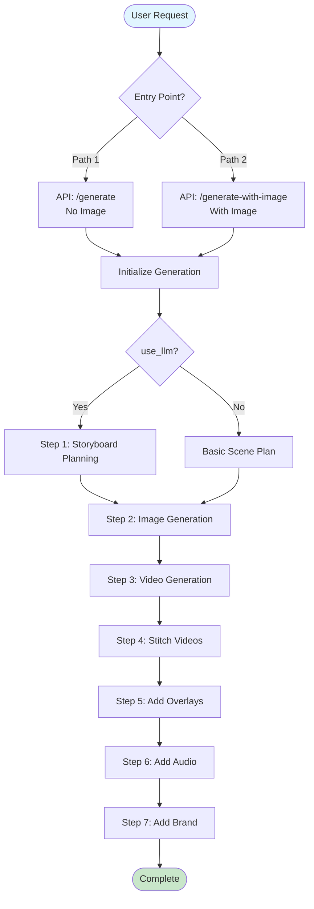
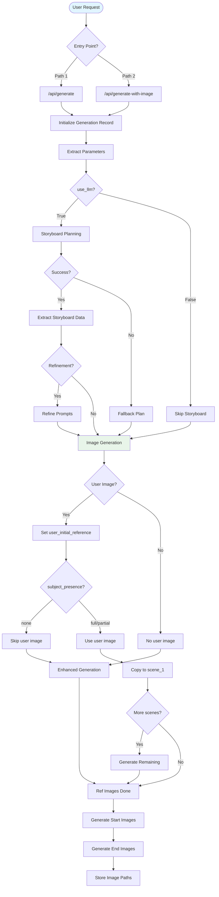
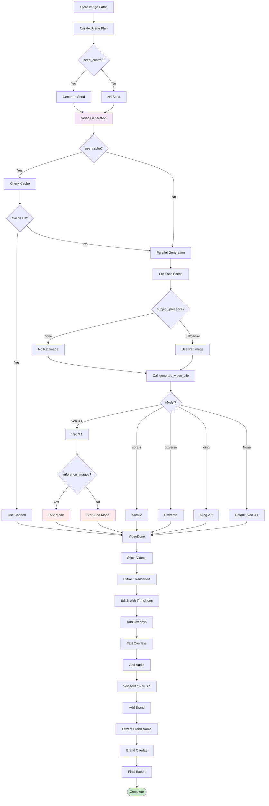

# Complete Pipeline Flow Diagram - All Possible Paths

## Entry Points

### Path 1: `/api/generate` (JSON Request)
- **Input**: JSON with prompt, model, target_duration, use_llm, etc.
- **Image**: None (image_path = None)

### Path 2: `/api/generate-with-image` (Multipart Form)
- **Input**: Form data with prompt + image file
- **Image**: User-provided image (saved to temp directory)

---

## Main Pipeline Flow: `process_generation()`

### High-Level Overview

### Detailed Flow: Entry to Image Generation

### Detailed Flow: Video Generation to Completion

---

## Detailed Condition Breakdown

### 1. Entry Point Conditions

| Condition | Path 1: `/api/generate` | Path 2: `/api/generate-with-image` |
|-----------|-------------------------|-----------------------------------|
| **Request Type** | JSON | Multipart Form Data |
| **image_path** | `None` | User's uploaded image path |
| **use_llm** | From request (default: `True`) | Always `True` |
| **use_advanced_image_generation** | From request (default: `False`, but always enabled) | Always `False` (but always enabled) |

### 2. Storyboard Planning Conditions

| Condition | Branch A: `use_llm = True` | Branch B: `use_llm = False` |
|-----------|---------------------------|----------------------------|
| **Storyboard Planning** | ✅ `plan_storyboard()` called | ❌ Skipped |
| **Consistency Markers** | ✅ Extracted from storyboard | ❌ None |
| **Scene Prompts** | ✅ Detailed prompts (40-80 words) | ❌ Basic prompts |
| **Subject Presence** | ✅ Tracked per scene | ❌ Not tracked |
| **Refinement** | ✅ If `refinement_instructions` provided | ❌ Not available |

### 3. Image Generation Conditions

| Condition | Branch A: User Image Provided | Branch B: No User Image |
|-----------|------------------------------|-------------------------|
| **First Scene Reference** | ✅ User's image copied directly | ✅ Generated with enhanced mode |
| **Initial Reference** | User's image (if `subject_presence != "none"`) | `None` |
| **Remaining Scenes** | ✅ Sequential chaining from user image | ✅ Sequential chaining from scene 1 |
| **Generation Mode** | Enhanced (always enabled) | Enhanced (always enabled) |
| **Variations** | 4 per scene | 4 per scene |
| **Quality Threshold** | 30.0 | 30.0 |

### 4. Subject Presence Conditions

| `subject_presence` Value | Reference Image | Start Image | End Image | Video Reference |
|-------------------------|----------------|-------------|-----------|----------------|
| `"none"` | ❌ Not used | ❌ Not used | ❌ Not used | ❌ Not used |
| `"full"` | ✅ Used | ✅ Used | ✅ Used | ✅ Used |
| `"partial"` | ✅ Used | ✅ If in start | ✅ If in end | ✅ Used |
| `"appears_at_start"` | ✅ Used | ✅ Used | ❌ Not used | ✅ Used |
| `"appears_at_end"` | ✅ Used | ❌ Not used | ✅ Used | ✅ Used |
| `"appears_mid_scene"` | ✅ Used | ✅ Used | ✅ Used | ✅ Used |
| `"disappears_mid_scene"` | ✅ Used | ✅ Used | ❌ Not used | ✅ Used |

### 5. Video Generation Model Conditions

| Model | R2V Mode | Start/End Frames | Reference Image | Special Parameters |
|-------|----------|------------------|------------------|-------------------|
| **google/veo-3.1** (Default) | ✅ 1-3 images | ✅ `image` + `last_frame` | ✅ If no R2V | `resolution`, `generate_audio`, `negative_prompt`, `seed` |
| **openai/sora-2** | ❌ | ❌ | ✅ `input_reference` | `quality: "high"` |
| **pixverse/pixverse-v5** | ❌ | ❌ | ✅ `input_reference` | `quality: "1080p"` |
| **kwaivgi/kling-v2.5-turbo-pro** | ❌ | ✅ `start_image` + `end_image` | ✅ `image` | All three simultaneously |

### 6. Veo 3.1 Mode Selection

| Condition | R2V Mode | Start/End Frame Mode |
|-----------|----------|---------------------|
| **Trigger** | `reference_images` array provided (1-3 images) | No `reference_images` |
| **Aspect Ratio** | `16:9` (forced) | `9:16` or `16:9` |
| **Duration** | `8s` (forced) | `4s`, `6s`, or `8s` (rounded) |
| **Parameters** | `reference_images`, `prompt`, `duration`, `aspect_ratio`, `resolution`, `generate_audio` | `image`, `last_frame`, `prompt`, `duration`, `aspect_ratio`, `resolution`, `generate_audio` |
| **`last_frame`** | ❌ Ignored | ✅ Used |

### 7. Seed Control Conditions

| Condition | Branch A: `seed_control = True` | Branch B: `seed_control = False` |
|-----------|-------------------------------|----------------------------------|
| **Seed Generation** | ✅ `get_seed_for_generation()` | ❌ Skipped |
| **Seed Value** | Same seed for all scenes | `None` (random per scene) |
| **Visual Consistency** | ✅ Enhanced | ❌ Standard |

### 8. Cache Conditions

| Condition | Branch A: Cache Enabled | Branch B: Cache Disabled |
|-----------|------------------------|-------------------------|
| **Cache Check** | ✅ `get_cached_clip()` per scene | ❌ Skipped |
| **Cache Hit** | ✅ Use cached clip (cost = 0) | N/A |
| **Cache Miss** | ✅ Generate new clip | ✅ Generate new clip |

### 9. Refinement Conditions

| Condition | Branch A: `refinement_instructions` Provided | Branch B: No Refinement |
|-----------|---------------------------------------------|------------------------|
| **Refinement** | ✅ `refine_storyboard_prompts()` called | ❌ Skipped |
| **Prompt Updates** | ✅ Prompts refined based on instructions | ❌ Original prompts used |
| **Re-extraction** | ✅ All prompts re-extracted after refinement | N/A |

---

## Complete Path Matrix

### Path Combinations

| # | Entry | use_llm | User Image | subject_presence (Scene 1) | Model | Seed Control | Cache | Refinement | Result |
|---|-------|---------|-----------|---------------------------|-------|--------------|-------|-----------|--------|
| 1 | `/api/generate` | ✅ | ❌ | N/A | Default (Veo 3.1) | ✅ | ❌ | ❌ | Standard generation |
| 2 | `/api/generate` | ✅ | ❌ | N/A | Veo 3.1 | ✅ | ✅ | ✅ | Cached + refined |
| 3 | `/api/generate-with-image` | ✅ | ✅ | `full` | Veo 3.1 | ✅ | ❌ | ❌ | User image used |
| 4 | `/api/generate-with-image` | ✅ | ✅ | `none` | Veo 3.1 | ✅ | ❌ | ❌ | User image skipped |
| 5 | `/api/generate` | ❌ | ❌ | N/A | Sora-2 | ❌ | ❌ | ❌ | Basic generation |
| 6 | `/api/generate-with-image` | ✅ | ✅ | `full` | Kling 2.5 | ✅ | ❌ | ✅ | Full feature set |

---

## Key Decision Points Summary

1. **Entry Point**: Determines if user image is available
2. **use_llm**: Determines if storyboard planning occurs
3. **User Image + subject_presence**: Determines if user image is used as first reference
4. **Model Selection**: Determines video generation parameters and capabilities
5. **Veo 3.1 Mode**: R2V vs Start/End Frame mode
6. **Seed Control**: Determines visual consistency across scenes
7. **Cache**: Determines if cached clips are reused
8. **Refinement**: Determines if prompts are refined before generation
9. **Subject Presence**: Determines which images are used for each scene

---

## Error Handling & Fallbacks

- **Storyboard Planning Failure**: Falls back to basic scene plan
- **Image Generation Failure**: Raises exception (stops generation)
- **Video Generation Failure**: Retries with exponential backoff
- **Text Overlay Failure**: Logs warning, continues without overlay
- **Audio Failure**: Logs warning, continues without audio
- **Brand Overlay Failure**: Logs warning, continues without brand overlay
- **Stitching Failure**: Raises exception (stops generation)

---

**Generated by Dev Agent (Amelia)**  
**Date**: 2025-11-19  
**File**: `backend/app/api/routes/generations.py` (3259 lines analyzed)

