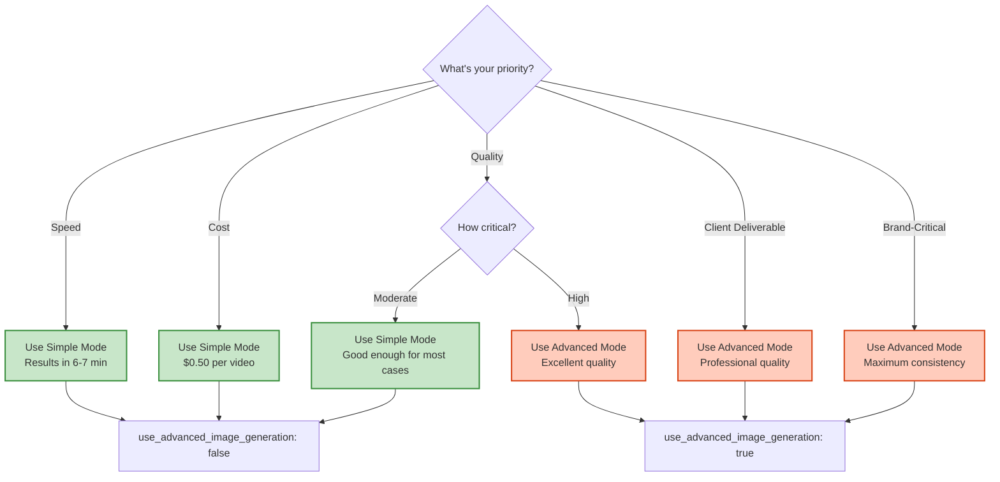

# Complete Pipeline Flow with Advanced Image Generation Option

## 🎬 Full Pipeline: User Prompt → Final Video

This diagram shows the **complete end-to-end pipeline** with both Simple and Advanced image generation modes.

---

```mermaid
flowchart TD
    Start([User Makes API Request]) --> APICheck{Advanced Mode<br/>Enabled?}
    
    APICheck -->|use_advanced_image_generation: false| SimplePath["🏃 SIMPLE PATH (Default)<br/>Fast, Cheap, Good Quality"]
    APICheck -->|use_advanced_image_generation: true| AdvancedPath["🚀 ADVANCED PATH<br/>Slow, Expensive, Excellent Quality"]
    
    SimplePath --> LLM["LLM Storyboard Planning<br/>GPT-4o generates scenes"]
    AdvancedPath --> LLM
    
    LLM --> StoryboardJSON["Storyboard JSON<br/>4 scene prompts ready"]
    
    StoryboardJSON --> ImageChoice{Image Generation<br/>Mode?}
    
    %% SIMPLE IMAGE PATH
    ImageChoice -->|Simple| SimpleImg["SIMPLE IMAGE GENERATION"]
    
    subgraph "Simple: 1 Image per Scene (60s total)"
        S1["Scene 1:<br/>1 image<br/>~15s"]
        S2["Scene 2:<br/>1 image (uses S1 ref)<br/>~15s"]
        S3["Scene 3:<br/>1 image (uses S2 ref)<br/>~15s"]
        S4["Scene 4:<br/>1 image (uses S3 ref)<br/>~15s"]
        
        S1 --> S2 --> S3 --> S4
    end
    
    SimpleImg --> S1
    S4 --> ImgDone["4 Reference Images Ready"]
    
    %% ADVANCED IMAGE PATH
    ImageChoice -->|Advanced| AdvancedImg["ADVANCED IMAGE GENERATION"]
    
    subgraph "Advanced: Scene 1 (90s)"
        A1Start["Scene 1 Start"] --> A1Enhance["2-Agent Prompt Enhancement<br/>~20s"]
        
        A1Enhance --> A1Gen["Generate 4 Variations<br/>~60s"]
        
        subgraph "4 Variations Generated"
            Var1["Var 1<br/>seed 1"]
            Var2["Var 2<br/>seed 2"]
            Var3["Var 3<br/>seed 3"]
            Var4["Var 4<br/>seed 4"]
        end
        
        A1Gen --> Var1 & Var2 & Var3 & Var4
        
        Var1 & Var2 & Var3 & Var4 --> A1Score["Score All 4 with ML Models<br/>~10s"]
        
        subgraph "Quality Scoring"
            Pick["PickScore<br/>50% weight"]
            CLIP["CLIP-Score<br/>25% weight"]
            VQA["VQAScore<br/>15% weight"]
            Aes["Aesthetic<br/>10% weight"]
        end
        
        A1Score --> Pick & CLIP & VQA & Aes
        Pick & CLIP & VQA & Aes --> A1Select["Select Best<br/>Rank 1"]
        
        A1Select --> A1Best["Scene 1 Best<br/>Score: 78.2"]
    end
    
    AdvancedImg --> A1Start
    
    A1Best --> A2["Scene 2<br/>Advanced (90s)<br/>Uses Scene 1 best as ref"]
    A2 --> A3["Scene 3<br/>Advanced (90s)<br/>Uses Scene 2 best as ref"]
    A3 --> A4["Scene 4<br/>Advanced (90s)<br/>Uses Scene 3 best as ref"]
    
    A4 --> ImgDone
    
    %% COMMON PATH AFTER IMAGES
    ImgDone --> StartEnd{Generate<br/>Start/End Frames<br/>(Kling)?}
    
    StartEnd -->|Yes| StartEndGen["Generate Start/End Frames<br/>8 images (2 per scene)<br/>~60s"]
    StartEnd -->|No| VideoPrep
    
    StartEndGen --> VideoPrep["Video Generation Prep<br/>Collect all image paths"]
    
    VideoPrep --> VideoGen["VIDEO GENERATION<br/>Parallel (All 4 at once)<br/>3-5 minutes"]
    
    subgraph "Parallel Video Generation"
        Vid1["Scene 1 Video<br/>Kling/Sora<br/>4s"]
        Vid2["Scene 2 Video<br/>Kling/Sora<br/>3s"]
        Vid3["Scene 3 Video<br/>Kling/Sora<br/>5s"]
        Vid4["Scene 4 Video<br/>Kling/Sora<br/>3s"]
    end
    
    VideoGen --> Vid1 & Vid2 & Vid3 & Vid4
    
    Vid1 & Vid2 & Vid3 & Vid4 --> Assembly["VIDEO ASSEMBLY<br/>~60s"]
    
    subgraph "Assembly Pipeline"
        Stitch["Stitch Clips<br/>Add transitions"]
        Text["Add Text Overlays<br/>with fallback"]
        Audio["Add Audio Layer<br/>with fallback"]
        Brand["Add Brand Overlay<br/>with fallback"]
        Export["Export Final Video"]
        
        Stitch --> Text --> Audio --> Brand --> Export
    end
    
    Assembly --> Stitch
    Export --> Final["FINAL VIDEO<br/>15 seconds<br/>1920x1080"]
    
    Final --> DB["Update Database<br/>Store metadata"]
    DB --> Response["Return to User<br/>video_url + storyboard"]
    
    Response --> End([User Downloads Video])
    
    %% STYLING
    style SimplePath fill:#c8e6c9,stroke:#388e3c,stroke-width:3px
    style AdvancedPath fill:#ffccbc,stroke:#d84315,stroke-width:3px
    style A1Enhance fill:#e1f5ff,stroke:#0288d1,stroke-width:2px
    style A1Score fill:#fff3e0,stroke:#f57c00,stroke-width:2px
    style A1Best fill:#c8e6c9,stroke:#388e3c,stroke-width:3px
    style Final fill:#c8e6c9,stroke:#388e3c,stroke-width:4px
```

---

## ⏱️ Total Timeline Comparison

### Simple Mode (Default)
```
LLM Storyboard:        20s
Image Generation:      60s  (4 scenes × 15s)
Start/End Frames:      60s  (if Kling)
Video Generation:     240s  (parallel)
Assembly:              60s
────────────────────────────
Total:              ~6-7 min
Cost:                $0.50
```

### Advanced Mode
```
LLM Storyboard:        20s
Image Generation:     360s  (4 scenes × 90s)
Start/End Frames:      60s  (if Kling)
Video Generation:     240s  (parallel)
Assembly:              60s
────────────────────────────
Total:             ~11-12 min
Cost:                $0.90
```

**Trade-off**: +5 minutes, +$0.40, **significantly higher image quality** ✨

---

## 🎯 Decision Tree



---

## 📊 Feature Comparison Matrix

| Aspect | **Simple Mode** | **Advanced Mode** |
|--------|-----------------|-------------------|
| **Speed** | ⚡⚡⚡⚡⚡ (6-7 min) | ⚡⚡ (11-12 min) |
| **Cost** | 💰 ($0.50) | 💰💰💰 ($0.90) |
| **Quality** | ⭐⭐⭐⭐ (Good) | ⭐⭐⭐⭐⭐ (Excellent) |
| **Consistency** | ✅ Good | ✅✅ Excellent |
| **Prompt Enhancement** | ❌ No | ✅ Yes (2-agent) |
| **Quality Scoring** | ❌ No | ✅ Yes (4 models) |
| **Variations** | 1 per scene | 4-8 per scene |
| **Best For** | Prototypes, Drafts | Production, Clients |
| **Default** | ✅ Yes | ⚪ Opt-in |

---

## 🚀 Quick Start

### Test Both Modes

**Simple Mode (6-7 min):**
```bash
POST /api/generate
{
  "prompt": "Artisan coffee advertisement"
}
```

**Advanced Mode (11-12 min):**
```bash
POST /api/generate
{
  "prompt": "Artisan coffee advertisement",
  "use_advanced_image_generation": true
}
```

### Monitor Progress

```bash
GET /api/status/{generation_id}

# Response includes:
{
  "progress": 45,
  "current_step": "Generating reference images",
  "advanced_image_generation_used": true
}
```

---

**The choice is yours! Simple for speed, Advanced for quality.** 🎯

