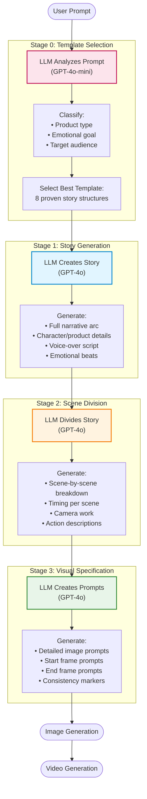

# Multi-Stage Story-Driven Video Generation System

## Overview

The Multi-Stage Story-Driven workflow is an advanced **4-stage LLM pipeline** that generates higher-quality advertisements by separating **narrative creation** from **visual specification**. This approach produces more creative, consistent, and emotionally engaging videos compared to the legacy single-stage system.

## Architecture



---

## Why Multi-Stage?

### Problems with Legacy Single-Stage:
- **Generic storytelling** - LLM tries to do everything at once
- **Inconsistent narratives** - No structured story framework
- **Visual focus overload** - Mixing story creation with visual details
- **Limited creativity** - All decisions made in one pass

### Benefits of Multi-Stage:
- ✅ **Better stories** - Dedicated story generation with proven templates
- ✅ **Character consistency** - Forensic-level character descriptions
- ✅ **Emotional depth** - Structured emotional arcs
- ✅ **Flexibility** - Can modify each stage independently
- ✅ **Creativity** - AI selects optimal storytelling structure

---

## The 8 Story Templates

### 1. **AIDA** (Attention → Interest → Desire → Action)
- **Best for**: Product launches, e-commerce, general advertising
- **Tone**: Energetic, aspirational, confident
- **Example**: "New smartphone launch"

### 2. **Problem-Agitate-Solve (PAS)**
- **Best for**: Problem-solving products, health & wellness, productivity
- **Tone**: Empathetic, relieving, reassuring
- **Example**: "Fitness app for busy moms"

### 3. **Before-After-Bridge (BAB)**
- **Best for**: Transformation products, fitness, beauty, lifestyle upgrades
- **Tone**: Inspirational, transformative, uplifting
- **Example**: "Skincare transformation"

### 4. **Hero's Journey**
- **Best for**: Aspirational brands, sports, personal empowerment, adventure
- **Tone**: Epic, empowering, heroic
- **Example**: "Marathon training app"

### 5. **Emotional Arc** (Feel-Good)
- **Best for**: Food & beverage, family products, comfort brands
- **Tone**: Warm, heartfelt, authentic
- **Example**: "Artisan coffee morning ritual"

### 6. **Teaser-Reveal**
- **Best for**: Luxury products, tech reveals, limited editions, high-end fashion
- **Tone**: Mysterious, sophisticated, dramatic
- **Example**: "Luxury perfume midnight elegance"

### 7. **Social Proof**
- **Best for**: Apps, community products, subscription services
- **Tone**: Trustworthy, inclusive, credible
- **Example**: "10M users tracking goals"

### 8. **Sensory Experience**
- **Best for**: Food & beverage, cosmetics, fragrances, ASMR content
- **Tone**: Indulgent, intimate, luxurious
- **Example**: "Gourmet chocolate tasting"

---

## Stage-by-Stage Breakdown

### Stage 0: Template Selection
**Duration**: ~2-3 seconds  
**Model**: GPT-4o-mini (fast, cost-effective)  
**Input**: User prompt  
**Output**: Selected template with reasoning

```json
{
  "selected_template": "emotional-arc",
  "confidence": 0.87,
  "reasoning": "Coffee + morning = intimate ritual. Emotional arc captures warmth and comfort of morning moments.",
  "alternative_template": "sensory-experience",
  "narrative_focus": "Warm morning ritual, comfort and connection",
  "emotional_goal": "Comfort and contentment"
}
```

---

### Stage 1: Story Generation
**Duration**: ~10-15 seconds  
**Model**: GPT-4o  
**Input**: User prompt + selected template  
**Output**: Complete narrative with script

```json
{
  "story_title": "Morning Ritual",
  "narrative": {
    "logline": "A busy professional discovers peace in her morning coffee ritual",
    "setup": "Sarah struggles with hectic mornings...",
    "development": "She discovers artisan coffee...",
    "climax": "First sip brings calm focus...",
    "resolution": "Now her mornings are sacred"
  },
  "character_subject": {
    "type": "both",
    "character_description": "Woman, 32 years old, 5 feet 6 inches tall, medium build (130 pounds). Long chestnut brown hair with subtle waves, side-parted left, mid-back length. Oval face with high cheekbones, emerald green almond-shaped eyes, warm beige skin (Fitzpatrick Type III). Small beauty mark near left eye above cheekbone. Ivory silk blouse with pearl buttons. Warm confident expression with subtle smile.",
    "product_description": "White ceramic coffee mug, 4 inches tall, modern minimalist design with matte finish, thin gold rim at top, steaming dark roast coffee visible inside.",
    "character_arc": "From rushed chaos to mindful calm"
  },
  "voice_over_script": {
    "lines": [
      {"beat": "Quiet Moment", "text": "Mornings used to be chaos..."},
      {"beat": "Surprise", "text": "Until I discovered this."},
      {"beat": "Joy", "text": "Now every morning starts with intention."},
      {"beat": "Connection", "text": "My moment of calm before the world wakes up."}
    ]
  }
}
```

**Key Features**:
- **Forensic character descriptions** - "Police description" level detail
- **Product specifications** - Exact physical details
- **Emotional arc** - Mapped to template beats
- **Voice-over script** - Natural, compelling copy

---

### Stage 2: Scene Division
**Duration**: ~10-15 seconds  
**Model**: GPT-4o  
**Input**: Story from Stage 1 + template structure  
**Output**: Scene-by-scene breakdown with timing

```json
{
  "total_duration": 15,
  "number_of_scenes": 4,
  "scenes": [
    {
      "scene_number": 1,
      "story_beat": "Quiet Moment",
      "duration_seconds": 4,
      "action_description": "Sarah sits at kitchen counter, morning light streaming through window. She's in pajamas, hair slightly messy, eyes still adjusting to the day. Camera slowly pushes in as she reaches for her coffee mug with both hands, cradling it gently. Steam rises from the mug in soft wisps.",
      "character_subject_presence": {
        "character_visible": true,
        "character_presence_timing": "full_scene",
        "product_visible": true,
        "product_presence_timing": "enters_at_2s"
      },
      "camera_work": {
        "angle": "Eye-level, slightly above",
        "movement": "Slow dolly in",
        "framing": "Medium shot transitioning to medium close-up",
        "lens_note": "Shallow depth of field, soft bokeh"
      },
      "lighting": {
        "setup": "Soft natural window light from left, warm morning glow, subtle fill from right",
        "mood": "Peaceful, intimate",
        "color_temperature": "Warm 3200K morning light"
      },
      "emotional_tone": "Contemplative calm",
      "voice_over": {
        "has_voiceover": true,
        "text": "Mornings used to be chaos...",
        "timing": "Starts at 0s, ends at 3s"
      }
    }
    // ... 3 more scenes
  ]
}
```

**Key Features**:
- **Specific actions** - Not "woman drinks coffee" but "brings mug to lips, eyes close, subtle smile forms"
- **Camera specifications** - Angle, movement, framing, lens
- **Lighting details** - Setup, mood, color temperature
- **Timing control** - Each scene 3-7 seconds

---

### Stage 3: Visual Specification
**Duration**: ~15-20 seconds  
**Model**: GPT-4o  
**Input**: Story + Scenes + Consistency rules  
**Output**: Detailed image generation prompts

```json
{
  "consistency_markers": {
    "subject_description": "Woman, 32 years old, 5'6\", chestnut brown hair, emerald eyes, beauty mark near left eye, ivory blouse...",
    "style": "Cinematic photorealistic 8k",
    "color_palette": "Warm earth tones, soft morning light",
    "lighting": "Soft natural window light",
    "mood": "Peaceful intimate calm"
  },
  "scenes": [
    {
      "scene_number": 1,
      "image_generation_prompt": "Woman, 32 years old, 5 feet 6 inches tall, medium build (130 pounds). Long chestnut brown hair with subtle waves, side-parted left, mid-back length. Oval face with high cheekbones, emerald green almond-shaped eyes, warm beige skin (Fitzpatrick Type III). Small beauty mark near left eye above cheekbone. Ivory silk blouse with pearl buttons. Warm confident expression. Sitting at modern kitchen counter, soft morning window light from left creating gentle shadows. White ceramic coffee mug with gold rim on counter. Shallow depth of field, soft bokeh background. Cinematic photorealistic 8k, warm earth tones.",
      "start_image_prompt": "Same woman (exact description) reaching towards white ceramic coffee mug on counter. Hands entering frame from bottom. Soft morning light. Eye-level angle.",
      "end_image_prompt": "Same woman (exact description) cradling white ceramic mug with both hands, steam rising. Eyes closed, peaceful expression. Soft morning light illuminating face."
    },
    {
      "scene_number": 2,
      "image_generation_prompt": "The EXACT SAME woman from Scene 1 (Woman, 32, 5'6\", chestnut hair, emerald eyes, beauty mark, ivory blouse) now bringing white ceramic mug with gold rim to lips. Close-up shot. Steam visible between mug and face. Soft morning light from left. Shallow focus on face, mug sharp. Peaceful anticipation expression. Same photorealistic 8k style, warm tones."
    }
    // ... 2 more scenes
  ]
}
```

**Key Features**:
- **Master template copying** - Character/product description copied verbatim
- **Three prompt types per scene**: 
  - `image_generation_prompt` - Main reference image
  - `start_image_prompt` - First frame
  - `end_image_prompt` - Last frame
- **Extreme detail** - 80-150 words per prompt
- **Consistency enforcement** - "EXACT SAME" language for scenes 2+

---

## API Usage

### Multi-Stage Request

```bash
POST /api/generate
{
  "prompt": "Artisan coffee that starts your morning right",
  "target_duration": 15,
  "use_multi_stage": true,
  "template_override": null  // Let AI select, or specify: "emotional-arc"
}
```

### Response

```json
{
  "generation_id": "abc123",
  "status": "processing",
  "message": "Multi-stage story generation started"
}
```

### Status Check

```bash
GET /api/status/abc123
```

```json
{
  "generation_id": "abc123",
  "status": "processing",
  "progress": 45,
  "current_step": "Stage 2: Scene Division",
  "workflow_type": "multi_stage_story_driven",
  "template_used": "emotional-arc",
  "story_title": "Morning Ritual",
  "multi_stage_data": {
    "stage_0_template_selection": {...},
    "stage_1_story": {...},
    "stage_2_scenes": {...},
    "stage_3_storyboard": {...}
  }
}
```

---

## File Structure

```
backend/app/services/pipeline/
├── story_templates.py              # 8 template definitions
├── template_selector.py            # Stage 0: AI template selection
├── story_generator.py              # Stage 1: Story creation
├── scene_divider.py                # Stage 2: Scene breakdown
├── storyboard_planner.py           # Stage 3: Visual prompts (updated)
└── multi_stage_orchestrator.py    # Orchestrates all 4 stages
```

---

## Comparison: Legacy vs Multi-Stage

| Feature | Legacy Single-Stage | Multi-Stage Story-Driven |
|---------|---------------------|--------------------------|
| **LLM Calls** | 1 | 4 |
| **Total Time** | ~10s | ~40-50s |
| **Story Quality** | Generic | Structured with template |
| **Character Detail** | Basic | Forensic (10+ identifiers) |
| **Narrative Arc** | Implicit | Explicit with emotional beats |
| **Voice-Over** | Not generated | Full script with timing |
| **Template Variety** | None | 8 proven structures |
| **Flexibility** | Low | High (modify each stage) |
| **Cost** | Lower | Higher (~4x tokens) |
| **Output Quality** | Good | Excellent |

---

## When to Use Multi-Stage

### Use Multi-Stage When:
- ✅ Quality is critical
- ✅ You need strong storytelling
- ✅ Character consistency matters
- ✅ Budget allows (~4x cost)
- ✅ Time allows (~4x duration)

### Use Legacy When:
- ✅ Speed is critical
- ✅ Cost is a concern
- ✅ Simple product showcase
- ✅ No complex characters

---

## Future Enhancements

1. **User feedback loop** - Allow users to refine story at each stage
2. **Template customization** - Let users create custom templates
3. **Voice-over generation** - Auto-generate voice-over audio from script
4. **Music selection** - AI-powered music matching
5. **A/B testing** - Generate multiple variations with different templates
6. **Analytics** - Track which templates perform best for different products

---

## Examples

### Example 1: Coffee Ad (Emotional Arc)

**Prompt**: `"Artisan coffee that starts your morning right"`

**Selected Template**: Emotional Arc  
**Story Title**: "Morning Ritual"  
**Scenes**: 4 (Quiet Moment → Surprise → Joy → Connection)  
**Duration**: 15s  
**Character**: Woman, 32, detailed description  
**Product**: White ceramic mug with gold rim  

---

### Example 2: Fitness App (Problem-Agitate-Solve)

**Prompt**: `"Fitness app for busy moms to stay healthy"`

**Selected Template**: Problem-Agitate-Solve  
**Story Title**: "Mom's Time"  
**Scenes**: 4 (Problem → Agitate → Solve → Relief)  
**Duration**: 15s  
**Character**: Mother, 35, juggling family and health  
**Product**: Smartphone with app interface  

---

### Example 3: Luxury Perfume (Teaser-Reveal)

**Prompt**: `"Luxury perfume capturing midnight elegance"`

**Selected Template**: Teaser-Reveal  
**Story Title**: "Midnight Mystery"  
**Scenes**: 4 (Mystery → Build → Reveal → Showcase)  
**Duration**: 15s  
**Character**: Not required (product-focused)  
**Product**: Frosted glass perfume bottle, detailed specs  

---

## Troubleshooting

### Issue: Template selection seems wrong
**Solution**: Use `template_override` to manually specify template

### Issue: Character changing between scenes
**Solution**: Check Stage 1 output - ensure forensic description is present

### Issue: Story doesn't match prompt
**Solution**: Refine prompt to be more specific about product/emotion

### Issue: Too slow
**Solution**: Use legacy single-stage for faster results

---

## Technical Notes

### Token Usage
- Stage 0: ~500 tokens
- Stage 1: ~2000-3000 tokens
- Stage 2: ~3000-4000 tokens
- Stage 3: ~4000-5000 tokens
- **Total**: ~10,000-13,000 tokens per generation

### Caching
- Template definitions: Cached in memory
- LLM responses: Not cached (each generation is unique)

### Error Handling
- Each stage has 3 retry attempts
- Fallback to AIDA template if Stage 0 fails
- Legacy workflow fallback if multi-stage fails

---

## Credits

- **Template Design**: Based on proven advertising frameworks (AIDA, PAS, BAB, Hero's Journey)
- **Character Consistency**: "Police Description" approach from Nov 18, 2025 fix
- **Architecture**: Multi-stage LLM pipeline inspired by creative workflows

---

**Last Updated**: November 19, 2025  
**Version**: 1.0.0  
**Status**: Production Ready

