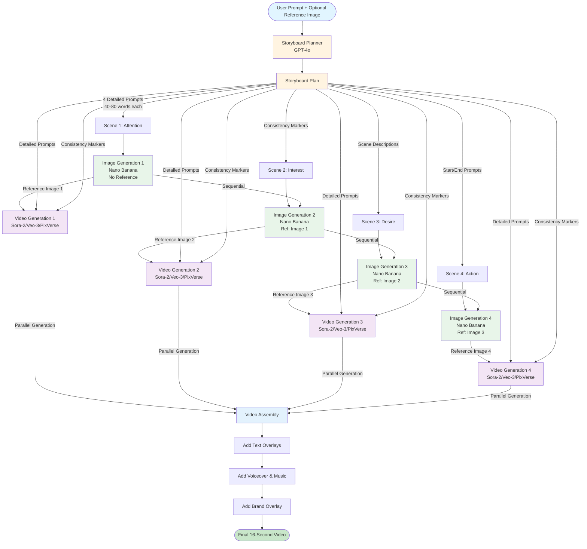
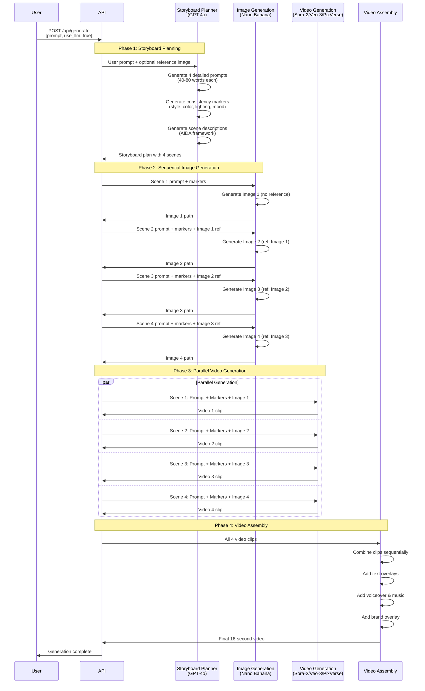
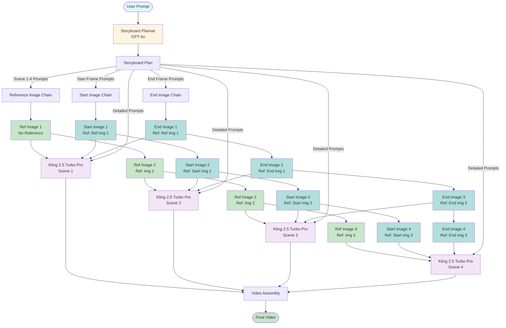
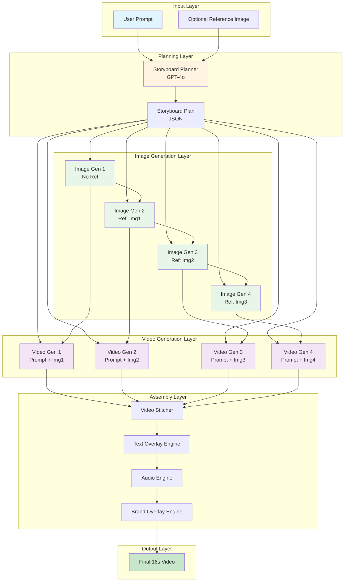
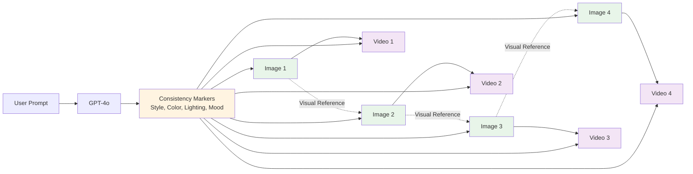

# LLM Enhancer Workflow - Mermaid Diagram

## Complete Workflow Visualization

## Detailed Phase Flow

## Kling 2.5 Turbo Pro Workflow (with Start/End Frames)

## Data Flow Architecture

## Consistency System Flow

