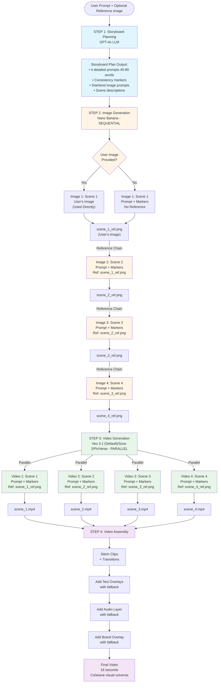
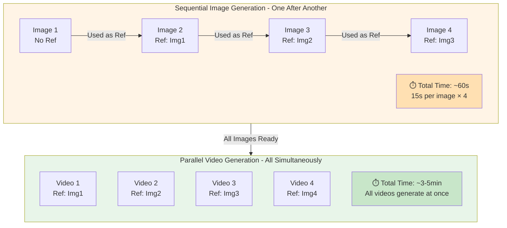

# Workflow Overview

## Complete Workflow Visualization

### High-Level Flow



### Sequential vs Parallel Comparison



## Text-Based Workflow

```
User Prompt
    ↓
STEP 1: Storyboard Planning (LLM GPT-4o)
    - Creates 4 detailed prompts (40-80 words each)
    - Generates consistency markers
    - Plans scene descriptions
    ↓
STEP 2: Image Generation (Nano Banana - Sequential)
    - Image 1: Enhanced prompt (detailed prompt + markers) (no reference)
    - Image 2: Enhanced prompt (detailed prompt + markers) + Image 1 reference
    - Image 3: Enhanced prompt (detailed prompt + markers) + Image 2 reference
    - Image 4: Enhanced prompt (detailed prompt + markers) + Image 3 reference
    - Enhanced prompts stored in storyboard plan for display
    ↓
STEP 3: Video Generation (Kling 2.5 Turbo Pro - Parallel)
    - Video 1: Detailed prompt + markers + Start image (UNIQUE first frame) + End image (UNIQUE last frame) + Reference (style only)
    - Video 2: Detailed prompt + markers + Start image (DIFFERENT first frame) + End image (DIFFERENT last frame) + Reference (style only)
    - Video 3: Detailed prompt + markers + Start image (DIFFERENT first frame) + End image (DIFFERENT last frame) + Reference (style only)
    - Video 4: Detailed prompt + markers + Start image (DIFFERENT first frame) + End image (DIFFERENT last frame) + Reference (style only)
    - CRITICAL: Each scene has UNIQUE start/end frames (different moments/poses), but shares subject/style via reference images and consistency markers
    ↓
STEP 4: Video Assembly
    - Stitch clips with transitions
    - Add text overlays (with fallback)
    - Add audio layer (with fallback)
    - Add brand overlay (with fallback)
    ↓
Final Video (16 seconds, cohesive visual universe)
```

## Phase Details

### Phase 1: Storyboard Planning

**Service**: `storyboard_planner.py`  
**Model**: GPT-4o (with vision if reference image provided)  
**Input**: User prompt + optional reference image  
**Output**: 
- 4 detailed prompts (40-80 words each)
- Start image prompts (for Kling 2.5 Turbo Pro - first frame descriptions)
- End image prompts (for Kling 2.5 Turbo Pro - last frame descriptions)
- Consistency markers (style, color, lighting, composition, mood)
- Scene descriptions

**Example Output**:
```json
{
  "consistency_markers": {
    "style": "dynamic modern minimalist",
    "color_palette": "vibrant primary colors",
    "lighting": "bright natural daylight",
    "composition": "dynamic angles with rule of thirds",
    "mood": "energetic optimistic"
  },
  "scenes": [
    {
      "scene_number": 1,
      "aida_stage": "Attention",
      "detailed_prompt": "A young professional jogging through a sunlit park in the morning, dynamic camera angle following their movement, vibrant colors, energetic atmosphere, rule of thirds composition, natural daylight creating soft shadows...",
      "duration_seconds": 4
    },
    ...
  ]
}
```

### Phase 2: Image Generation

**Service**: `image_generation.py` + `image_generation_batch.py`  
**Model**: Nano Banana (google/nano-banana) on Replicate  
**Input**: 
- Detailed prompt from storyboard
- Consistency markers
- Previous image as reference (for images 2-4)

**Process**:
1. Generate reference images sequentially (one per scene)
   - Each uses enhanced prompt (base prompt + consistency markers)
   - Enhanced prompts stored in storyboard plan for display
2. Generate start images sequentially (for Kling 2.5 Turbo Pro - first frames)
   - Each uses enhanced prompt (start_image_prompt + consistency markers)
   - Enhanced prompts stored in storyboard plan for display
3. Generate end images sequentially (for Kling 2.5 Turbo Pro - last frames)
   - Each uses enhanced prompt (end_image_prompt + consistency markers)
   - Enhanced prompts stored in storyboard plan for display

**Output**:
- Reference images: `output/temp/images/{generation_id}/scene_{n}.png`
- Start images: `output/temp/images/{generation_id}/start/scene_{n}.png`
- End images: `output/temp/images/{generation_id}/end/scene_{n}.png`
- Enhanced prompts stored in storyboard plan for frontend display

**Key Feature**: Sequential generation ensures visual consistency chain

**Kling 2.5 Turbo Pro Support**:
- When using Kling 2.5 Turbo Pro, generates three images per scene:
  - Reference image (main scene representation)
  - Start image (first frame of video)
  - End image (last frame of video)
- All three images are passed to Kling 2.5 Turbo Pro for precise video control

### Phase 3: Video Generation

**Service**: `video_generation.py`  
**Models**: Sora-2, Veo-3, PixVerse, Kling 2.5 Turbo Pro (via Replicate)  
**Input**:
- Detailed prompt from storyboard
- Consistency markers
- Generated reference image for that scene
- Start image (for Kling 2.5 Turbo Pro - optional)
- End image (for Kling 2.5 Turbo Pro - optional)

**Process**:
1. Enhance prompt with consistency markers
2. Generate video in parallel (all scenes simultaneously)
3. Use corresponding generated reference image
4. For Kling 2.5 Turbo Pro: Use start and end images for precise frame control
5. Store video clip paths

**Key Feature**: Parallel generation for speed, detailed prompts for quality

**Kling 2.5 Turbo Pro**:
- Model: `kwaivgi/kling-v2.5-turbo-pro` on Replicate
- Supports reference image, start image, and end image simultaneously
- Provides precise control over first and last frames
- Better motion control and transitions

## Data Flow

```
User Prompt
    ↓
Storyboard Planner (GPT-4o)
    ├─→ Detailed Prompts (4 scenes)
    ├─→ Consistency Markers
    └─→ Scene Descriptions
    ↓
Image Generation (Nano Banana - Sequential)
    ├─→ Image 1: Prompt 1 + Markers
    ├─→ Image 2: Prompt 2 + Markers + Image 1 ref
    ├─→ Image 3: Prompt 3 + Markers + Image 2 ref
    └─→ Image 4: Prompt 4 + Markers + Image 3 ref
    ↓
Video Generation (Sora-2/Veo-3/PixVerse - Parallel)
    ├─→ Video 1: Prompt 1 + Markers + Image 1 ref
    ├─→ Video 2: Prompt 2 + Markers + Image 2 ref
    ├─→ Video 3: Prompt 3 + Markers + Image 3 ref
    └─→ Video 4: Prompt 4 + Markers + Image 4 ref
    ↓
Video Assembly
    └─→ Final 16-second video
```

