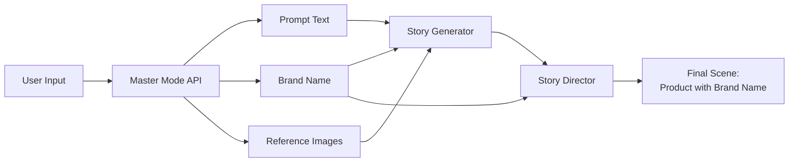

# Brand Name Integration

**Date:** November 21, 2024  
**Feature:** Use user-provided brand name in final product showcase

## Overview

The brand name displayed in the final scene now comes from the user's input (`brand_name` field) rather than being extracted from reference images. This ensures:
- User has full control over brand naming
- Brand name is consistently displayed as specified
- Correct spelling and capitalization
- Flexibility to use brand names different from image labels

## Implementation

### API Flow



### Code Changes

#### 1. API Route (`master_mode.py`)

**Pass brand_name to story generation:**

```python
story_result = await generate_story_iterative_with_streaming(
    user_prompt=prompt,
    generation_id=generation_id,
    max_iterations=max_iterations,
    reference_image_paths=saved_image_paths if saved_image_paths else None,
    brand_name=brand_name  # ✅ Added
)
```

#### 2. Streaming Wrapper (`streaming_wrapper.py`)

**Accept and forward brand_name:**

```python
async def generate_story_iterative_with_streaming(
    user_prompt: str,
    generation_id: str,
    max_iterations: int = 3,
    reference_image_paths: Optional[List[str]] = None,
    brand_name: Optional[str] = None  # ✅ Added
) -> StoryGenerationResult:
    
    result = await _generate_story_iterative(
        user_prompt=user_prompt,
        max_iterations=max_iterations,
        reference_image_paths=reference_image_paths,
        brand_name=brand_name  # ✅ Forwarded
    )
```

#### 3. Story Generator (`story_generator.py`)

**Accept and pass brand_name to director:**

```python
async def generate_story_iterative(
    user_prompt: str,
    max_iterations: int = 3,
    reference_image_paths: Optional[List[str]] = None,
    brand_name: Optional[str] = None,  # ✅ Added
    ...
) -> StoryGenerationResult:
    
    story_draft = await generate_story_draft(
        user_prompt=user_prompt,
        feedback=feedback_text,
        conversation_history=history_dict,
        reference_image_paths=reference_image_paths,
        brand_name=brand_name,  # ✅ Passed
        model=director_model
    )
```

#### 4. Story Director (`story_director.py`)

**Use brand_name in instructions:**

```python
async def generate_story_draft(
    user_prompt: str,
    feedback: Optional[str] = None,
    conversation_history: Optional[List[dict]] = None,
    reference_image_paths: Optional[List[str]] = None,
    brand_name: Optional[str] = None,  # ✅ Added
    model: str = "gpt-4o",
    max_retries: int = 3
) -> str:
```

**Add explicit brand name instructions:**

```python
if brand_name:
    user_message_parts.append(
        f"🏷️ **BRAND NAME (CRITICAL):**\n"
        f"The brand name is: **\"{brand_name}\"**\n\n"
        f"⚠️ **YOU MUST:**\n"
        f"1. Feature this EXACT brand name in your story\n"
        f"2. In the final scene, ensure the brand name \"{brand_name}\" is clearly visible on the product\n"
        f"3. Describe how the brand name appears (font, color, placement on product)\n"
        f"4. Make the brand name prominent and legible in the final product showcase\n"
        f"5. Do NOT change, abbreviate, or modify the brand name in any way\n\n"
    )
```

## User Experience

### Form Input

```
Frontend Form:
┌─────────────────────────────────────┐
│ Advertisement Prompt *              │
│ ┌─────────────────────────────────┐ │
│ │ A luxurious perfume ad          │ │
│ └─────────────────────────────────┘ │
│                                     │
│ Reference Images *                  │
│ [Upload] [Upload] [Upload]          │
│                                     │
│ Brand Name (Optional)               │
│ ┌─────────────────────────────────┐ │
│ │ MIDNIGHT ESSENCE                │ │ ← User enters brand
│ └─────────────────────────────────┘ │
│                                     │
│ [Generate Advertisement]            │
└─────────────────────────────────────┘
```

### Story Output

**Scene 3 (Final) Description:**

```markdown
### Scene 3: Action (5 seconds)

**Visual Description:**
The camera slowly pushes in on the MIDNIGHT ESSENCE perfume bottle, 
now centered on the marble vanity. The elegant crystal bottle catches 
soft window light from the left at 45 degrees, creating gentle 
highlights on its faceted surface. 

**BRAND NAME "MIDNIGHT ESSENCE"** is displayed in elegant gold script 
across the front face of the bottle, perfectly legible and prominent. 
The lettering is in a serif font, approximately 0.8 inches tall, with 
a subtle embossed effect that catches the light...

**End Frame:**
The perfume bottle occupies the golden ratio sweet spot in the frame, 
with the brand name "MIDNIGHT ESSENCE" clearly visible and crisp. 
Premium product photography aesthetic with shallow f/2.8 depth of field...
```

## Priority System

### Brand Name Source Hierarchy

1. **User-Provided Brand Name** (Highest Priority)
   - If user enters brand_name field → Use this EXACTLY
   - Display this exact text in final scene
   - Do not modify, abbreviate, or change

2. **Brand from Reference Image** (Secondary)
   - If no user-provided brand_name → Extract from product image
   - Use OCR/vision to read brand from image
   - Match visual appearance (font, placement)

3. **Generic/No Brand** (Fallback)
   - If neither provided → Use generic product showcase
   - Focus on product beauty without specific branding

### Example Scenarios

**Scenario 1: User Provides Brand Name**
```
Input:
- Prompt: "Perfume ad"
- Brand Name: "MIDNIGHT ESSENCE"
- Images: [person, person, perfume bottle with "Sample" label]

Output:
✅ Final scene shows "MIDNIGHT ESSENCE" (from user input)
❌ Does NOT show "Sample" (from image)
```

**Scenario 2: No Brand Name Provided**
```
Input:
- Prompt: "Perfume ad"
- Brand Name: (empty)
- Images: [person, person, perfume bottle with "CHANEL" logo]

Output:
✅ Final scene shows "CHANEL" (from reference image)
```

**Scenario 3: Brand Name + Branded Image**
```
Input:
- Prompt: "Perfume ad"
- Brand Name: "NOUVEAU PARFUM"
- Images: [person, person, perfume bottle with "CHANEL" logo]

Output:
✅ Final scene shows "NOUVEAU PARFUM" (user input takes precedence)
❌ Does NOT show "CHANEL"
```

## Benefits

✅ **User Control**: User decides exact brand name spelling and capitalization  
✅ **Flexibility**: Can use different brand than what's on reference image  
✅ **Consistency**: Same brand name throughout all scenes  
✅ **Professional**: Matches user's branding guidelines  
✅ **Quality**: No OCR errors or misreadings from images  

## Testing

### Test Cases

**Test 1: With Brand Name**
```python
Input:
- prompt="Luxury watch ad"
- brand_name="CHRONOS ROYAL"
- images=[man, woman, watch]

Expected Output:
- Story mentions "CHRONOS ROYAL"
- Final scene: "CHRONOS ROYAL" clearly visible on watch face
- No other brand names appear
```

**Test 2: Without Brand Name**
```python
Input:
- prompt="Luxury watch ad"
- brand_name=None
- images=[man, woman, Rolex watch]

Expected Output:
- Story describes watch from image (Rolex styling)
- Final scene: Brand from image or generic "luxury watch"
```

**Test 3: Special Characters**
```python
Input:
- brand_name="L'ÉTOILE NOIRE"

Expected Output:
- Exact string "L'ÉTOILE NOIRE" preserved
- Accent marks and apostrophe maintained
- Displayed correctly in final scene
```

### Validation

**Story Director Output Check:**
```python
# If brand_name provided
assert brand_name in story_draft
assert f'"{brand_name}"' in final_scene_description

# Count occurrences (should appear multiple times)
occurrences = story_draft.count(brand_name)
assert occurrences >= 2  # At least in product details and final scene
```

## Frontend Display

### Form Validation

```typescript
// Optional field - no validation required
// But if provided, should be:
- Min length: 1 character
- Max length: 50 characters
- Allowed: Letters, numbers, spaces, basic punctuation
```

### Placeholder Text

```
Brand Name (Optional)
┌─────────────────────────────────────────┐
│ e.g., CHANEL, Nike, Midnight Essence   │
└─────────────────────────────────────────┘
```

### Help Text

```
"Enter the brand name to display on the product.
Leave blank to use the brand from your reference image."
```

## Documentation Updates

### API Documentation

```
POST /api/master-mode/generate-story

Parameters:
- prompt (required): Advertisement concept description
- reference_images (optional): 1-3 images (people + product)
- brand_name (optional): Brand name to display on product
  * If provided: This exact text will appear in final scene
  * If not provided: Brand from reference image will be used
  * Example: "MIDNIGHT ESSENCE", "Nike", "CHANEL"
- title (optional): Video title
- max_iterations (optional): Max iteration rounds (default: 3)
```

### User Guide

**When to Provide Brand Name:**
- ✅ When you want specific brand text displayed
- ✅ When reference image has wrong/generic branding
- ✅ When you need exact spelling/capitalization
- ✅ For new products without existing imagery

**When to Omit Brand Name:**
- Use reference image has correct branding
- Want to match existing product exactly
- Testing/prototyping without specific brand

## Files Changed

1. ✅ `backend/app/api/routes/master_mode.py`
   - Pass brand_name to story generation

2. ✅ `backend/app/services/master_mode/streaming_wrapper.py`
   - Accept and forward brand_name parameter

3. ✅ `backend/app/services/master_mode/story_generator.py`
   - Accept brand_name and pass to director

4. ✅ `backend/app/services/master_mode/story_director.py`
   - Accept brand_name parameter
   - Add explicit brand name instructions
   - Enforce brand name in final scene

5. ✅ Created `master-mode/BRAND_NAME_INTEGRATION.md` - Full documentation

---

**Status:** ✅ Implementation Complete  
**Impact:** User-provided brand names now prominently featured in final scene  
**Priority:** User input > Reference image > Generic  
**Quality:** Exact spelling and capitalization preserved  

**Example Output:**

```
User Input: brand_name="MIDNIGHT ESSENCE"

Final Scene Description:
"...The elegant crystal perfume bottle sits centered on the marble 
vanity. The brand name 'MIDNIGHT ESSENCE' is displayed in gold script 
across the bottle's front face, measuring 0.8 inches tall with elegant 
serif lettering. The text is perfectly legible, with subtle embossing 
that catches the key light from camera-left..."
```

Ready to test! 🚀

