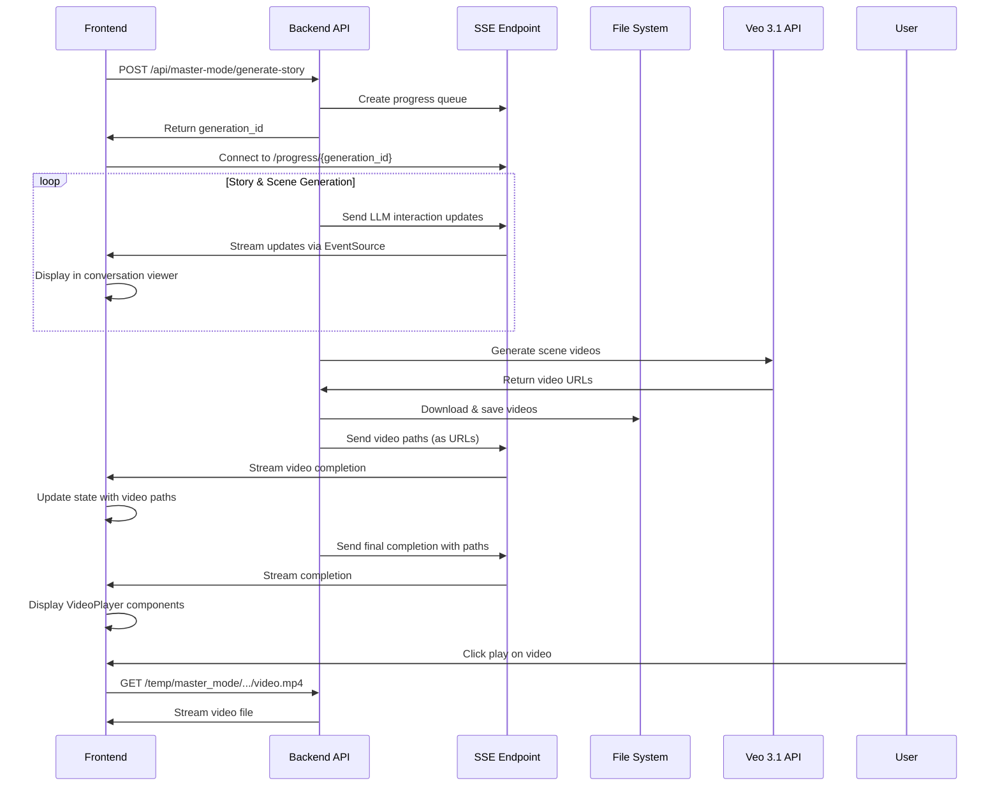

# Frontend Video Display Fix

**Date:** November 21, 2024  
**Issue:** Frontend was not showing LLM conversation updates or video playback after generation completed.

## Problems Identified

### 1. Video Files Not Accessible
- **Issue:** Backend saved videos in `temp/master_mode/...` but only `/output` was mounted for static file serving
- **Impact:** Frontend couldn't access generated videos

### 2. Wrong Path Format in Progress Updates
- **Issue:** Backend sent Windows file paths (e.g., `temp\master_mode\...`) instead of URLs
- **Impact:** Frontend received paths it couldn't use

### 3. Missing Completion Data
- **Issue:** Final completion message didn't include video paths
- **Impact:** If frontend missed the earlier video completion message, it would never get the paths

## Solutions Implemented

### 1. Mount Temp Directory (`backend/app/main.py`)

Added mounting for `/temp` directory to serve master mode videos:

```python
# Mount temp directory for serving master mode videos
temp_dir = Path("temp")
if temp_dir.exists():
    app.mount("/temp", StaticFiles(directory="temp"), name="temp")
    logger.info("Static files mounted at /temp")
else:
    logger.warning("Temp directory not found - creating it now")
    temp_dir.mkdir(parents=True, exist_ok=True)
    app.mount("/temp", StaticFiles(directory="temp"), name="temp")
    logger.info("Static files mounted at /temp")
```

### 2. Convert Paths to URLs (`backend/app/api/routes/master_mode.py`)

Added a helper function to convert file system paths to URL paths:

```python
def path_to_url(path_str: str) -> str:
    """Convert file system path to URL path"""
    # Normalize path separators to forward slashes
    normalized = str(path_str).replace("\\", "/")
    # Ensure it starts with /
    if not normalized.startswith("/"):
        normalized = "/" + normalized
    return normalized
```

Applied this to both scene videos and final video paths before sending to frontend.

### 3. Include Video Paths in Final Completion

Updated the final completion message to always include video paths if available:

```python
# Send final completion with video paths if available
completion_data = {}
if "final_video_path" in response and response.get("video_generation_status") == "success":
    completion_data["final_video_path"] = response["final_video_path"]
    completion_data["scene_videos"] = response.get("scene_videos", [])

await send_progress_update(generation_id, "complete", "completed", 100, "Generation complete!", completion_data)
```

### 4. Fix Video URL Construction (`frontend/src/components/master-mode/VideoPlayer.tsx`)

Updated the VideoPlayer component to properly handle paths with leading slashes:

```typescript
const apiUrl = import.meta.env.VITE_API_URL || "http://localhost:8000";
// Remove leading slash from videoPath if present, as we'll add it when constructing the URL
const cleanPath = videoPath.startsWith("/") ? videoPath.substring(1) : videoPath.replace(/\\/g, "/");
const videoUrl = videoPath.startsWith("http") ? videoPath : `${apiUrl}/${cleanPath}`;
```

## Testing Instructions

### Manual Testing Steps

1. **Start Backend:**
   ```powershell
   cd D:\gauntlet-ai\ad-mint-ai\backend
   uvicorn app.main:app --reload --host 0.0.0.0 --port 8000
   ```

2. **Start Frontend:**
   ```powershell
   cd D:\gauntlet-ai\ad-mint-ai\frontend
   npm run dev
   ```

3. **Test Generation:**
   - Navigate to Master Mode
   - Fill in the form with:
     - A prompt (e.g., "A luxurious perfume ad")
     - At least one reference image
   - Click "Generate Advertisement"

4. **Verify Real-Time Updates:**
   - ✅ Toast message appears: "Generation started!"
   - ✅ LLM Conversation Viewer appears below the form
   - ✅ You see AI agents conversing in real-time
   - ✅ Progress bar updates from 0% to 100%

5. **Verify Video Display:**
   - ✅ After completion, scene videos appear in a grid
   - ✅ Final video appears below scene videos
   - ✅ Videos are playable with controls
   - ✅ Download button works

### Expected Behavior

**During Generation:**
- Real-time progress updates showing each agent's work
- Progress bar smoothly animating
- LLM conversation displaying:
  - Story Director iterations
  - Story Critic feedback
  - Scene Writer work
  - Scene Critic feedback
  - Scene Cohesor analysis
  - Scene Enhancer improvements
  - Scene Aligner consistency checks

**After Completion:**
- Success toast message
- Scene videos grid (one card per scene)
- Final stitched video prominently displayed
- All videos playable with native browser controls
- Download buttons functional

## Architecture Flow



## Files Changed

1. **`backend/app/main.py`**
   - Added `/temp` directory mounting for static file serving

2. **`backend/app/api/routes/master_mode.py`**
   - Added `path_to_url()` helper function
   - Convert file paths to URLs before sending to frontend
   - Include video paths in final completion message

3. **`frontend/src/components/master-mode/VideoPlayer.tsx`**
   - Fixed URL construction to handle paths with leading slashes

4. **Documentation:**
   - Created this file: `FRONTEND_VIDEO_DISPLAY_FIX.md`

## Notes

### Why Mount /temp Instead of Copying to /output?

- **Performance:** Avoids unnecessary file copying
- **Disk Space:** Doesn't duplicate large video files
- **Real-time Access:** Videos available immediately after generation
- **Cleanup:** Easier to clean temp directory periodically

### URL Format

Generated video URLs follow this pattern:
```
http://localhost:8000/temp/master_mode/{user_id}/{generation_id}/scene_videos/scene_01.mp4
http://localhost:8000/temp/master_mode/{user_id}/{generation_id}/final_video_20241121_123456.mp4
```

### Frontend State Management

The `MasterMode.tsx` component manages:
- `generationId`: Tracks current generation
- `sceneVideos`: Array of scene video URLs
- `finalVideo`: URL of final stitched video
- `showConversation`: Controls LLM viewer visibility

The `LLMConversationViewer` handles:
- SSE connection to backend
- Real-time message parsing
- Progress tracking
- Completion/error callbacks to parent

## Known Limitations

1. **No Persistence:** Videos in `/temp` may be cleaned up periodically
2. **No Database Tracking:** Generated videos aren't saved to database yet
3. **No History View:** Users can't view previously generated videos
4. **Single Generation:** Starting a new generation hides previous results

## Future Enhancements

1. **Save to Database:** Store generation metadata and video paths
2. **History View:** Allow users to browse past generations
3. **Cleanup Job:** Background task to remove old temp files
4. **S3 Integration:** Upload final videos to S3 for persistence
5. **Thumbnail Generation:** Create video thumbnails for gallery view
6. **Sharing:** Generate shareable links for completed videos

## Success Criteria

✅ Backend serves videos from `/temp` directory  
✅ File paths converted to proper URLs  
✅ Frontend receives video paths in completion message  
✅ VideoPlayer properly constructs video URLs  
✅ Videos display and play correctly  
✅ Download functionality works  
✅ No 404 errors when accessing videos  

---

**Status:** ✅ Implementation Complete  
**Next Steps:** Test with actual video generation (requires Replicate API credits)

