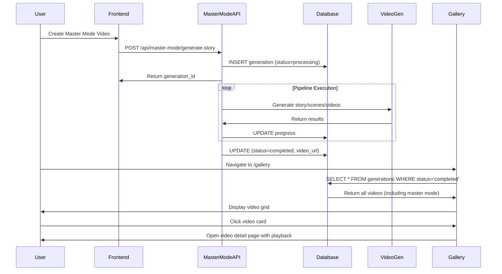

# Master Mode Gallery Integration

**Date:** November 21, 2024  
**Feature:** Integrate Master Mode generated videos into the main gallery

## Overview

Master Mode videos are now automatically saved to the database and appear in the main gallery alongside regular generations. This allows users to:
- View all their generated videos in one place
- Access master mode videos from the gallery
- Track generation history
- Use the video detail page to view metadata

## Implementation

### Database Integration

Master Mode generations are now stored in the `generations` table with the following characteristics:

**Key Fields:**
- `id`: The generation_id from the Master Mode pipeline
- `user_id`: The user who created the generation
- `prompt`: The advertisement prompt provided by the user
- `title`: User-provided title or "Master Mode Video" by default
- `status`: Tracks progress (processing → completed/failed)
- `progress`: 0-100% completion indicator
- `framework`: Set to "master_mode" for easy filtering
- `video_path`: File system path to the final stitched video
- `video_url`: URL path accessible from frontend
- `temp_clip_paths`: Array of URLs to individual scene videos
- `num_scenes`: Number of scenes generated
- `generation_time_seconds`: Total time from start to completion
- `created_at`: When generation started
- `completed_at`: When generation finished

### Code Changes

#### 1. Import Generation Model (`backend/app/api/routes/master_mode.py`)

```python
from app.db.models.generation import Generation
```

#### 2. Create Database Record on Start

```python
# Generate unique ID for this generation
generation_id = str(uuid.uuid4())
start_time = datetime.utcnow()

# Create database record for this generation
db_generation = Generation(
    id=generation_id,
    user_id=current_user.id,
    prompt=prompt,
    title=title or "Master Mode Video",
    status="processing",
    progress=0,
    current_step="Initializing...",
    framework="master_mode",  # Special framework identifier
    created_at=start_time
)
db.add(db_generation)
db.commit()
```

#### 3. Update Progress Throughout Pipeline

**After Story Generation:**
```python
db_generation.progress = 30
db_generation.current_step = "Story generated"
db.commit()
```

**After Scene Generation:**
```python
db_generation.progress = 55
db_generation.current_step = f"Generated {scenes_result.total_scenes} scenes"
db_generation.num_scenes = scenes_result.total_scenes
db.commit()
```

**After Video Generation (Success):**
```python
db_generation.video_path = final_video_path
db_generation.video_url = final_video_url
db_generation.temp_clip_paths = scene_video_urls
db_generation.num_scenes = len(video_params_list)
db_generation.num_clips = len(video_params_list)
db_generation.status = "completed"
db_generation.progress = 100
db_generation.current_step = "Complete"
db_generation.completed_at = datetime.utcnow()
db_generation.generation_time_seconds = int((datetime.utcnow() - start_time).total_seconds())
db.commit()
```

**On Error:**
```python
db_generation.status = "failed"
db_generation.error_message = str(e)
db_generation.progress = 0
db_generation.current_step = "Failed"
db.commit()
```

## Gallery Display

### How It Works

1. **Gallery Fetches All Completed Generations:**
   - The gallery component calls `getGenerations()` with `status: "completed"`
   - This includes both regular generations and master mode videos

2. **Master Mode Videos Are Distinguished:**
   - `framework` field is set to "master_mode"
   - Can be used for filtering if needed in the future

3. **Video Card Shows:**
   - Video thumbnail (if available)
   - Video player with the final stitched video
   - Title: User-provided or "Master Mode Video"
   - Prompt: The advertisement description
   - Generation date and time
   - Status badge

4. **Clicking a Card:**
   - Opens the video detail page
   - Shows full video player
   - Displays metadata (scenes, duration, generation time)
   - Provides download option

### Example Gallery View

```
┌─────────────┬─────────────┬─────────────┐
│  Video 1    │  Video 2    │ Master Mode │
│  (Regular)  │  (Regular)  │   Video 1   │
│  ▶ Play     │  ▶ Play     │  ▶ Play     │
│  "Product"  │  "Service"  │  "Perfume"  │
└─────────────┴─────────────┴─────────────┘
┌─────────────┬─────────────┬─────────────┐
│ Master Mode │  Video 3    │ Master Mode │
│   Video 2   │  (Regular)  │   Video 3   │
│  ▶ Play     │  ▶ Play     │  ▶ Play     │
│  "Watch Ad" │  "Food"     │  "Fashion"  │
└─────────────┴─────────────┴─────────────┘
```

## Testing

### Manual Testing Steps

1. **Generate a Master Mode Video:**
   ```
   - Navigate to /master-mode
   - Fill in prompt: "A luxurious perfume advertisement"
   - Upload reference images
   - Click "Generate Advertisement"
   - Wait for completion (videos need API credits)
   ```

2. **Check Gallery:**
   ```
   - Navigate to /gallery
   - Verify the new video appears in the grid
   - Click on the video card
   - Verify it opens in video detail page
   - Verify video plays correctly
   ```

3. **Verify Database:**
   ```sql
   SELECT id, title, prompt, status, framework, num_scenes, video_url
   FROM generations
   WHERE framework = 'master_mode'
   ORDER BY created_at DESC;
   ```

### Expected Results

✅ Master mode generation creates a database record immediately  
✅ Progress updates throughout the pipeline  
✅ Video URLs are saved on completion  
✅ Gallery shows the new video  
✅ Video card displays correct information  
✅ Clicking opens video detail page  
✅ Video plays with proper controls  
✅ Download works  
✅ Failed generations show error state  

## Architecture Flow



## Data Flow

### Master Mode Pipeline → Database

```
User Input (Prompt, Images)
    ↓
Generate Story (LLM)
    ↓ [DB Update: progress=30]
Generate Scenes (LLM)
    ↓ [DB Update: progress=55]
Enhance Scenes (LLM)
    ↓ [DB Update: progress=60]
Align Scenes (LLM)
    ↓ [DB Update: progress=65]
Generate Videos (Veo 3.1)
    ↓ [DB Update: progress=95]
Stitch Videos (MoviePy)
    ↓ [DB Update: status=completed, video_url, progress=100]
Complete
```

### Database → Gallery Display

```
Database Record:
{
  id: "abc-123",
  title: "Perfume Ad",
  prompt: "A luxurious...",
  status: "completed",
  framework: "master_mode",
  video_url: "/temp/master_mode/.../final_video.mp4",
  temp_clip_paths: ["/temp/.../scene_01.mp4", ...],
  num_scenes: 3,
  generation_time_seconds: 180,
  created_at: "2024-11-21T12:00:00Z",
  completed_at: "2024-11-21T12:03:00Z"
}
    ↓
Gallery Component (GET /api/generations?status=completed)
    ↓
VideoCard Component
    ↓
Display: Title, Thumbnail, Play Button, Metadata
```

## Benefits

1. **Unified Experience:** All videos in one place
2. **History Tracking:** Users can view past master mode generations
3. **Easy Access:** No need to remember generation IDs
4. **Consistent UI:** Same interface for all video types
5. **Metadata Preservation:** Generation details saved for future reference
6. **Error Handling:** Failed generations tracked and visible

## Future Enhancements

### Phase 1: Enhanced Gallery Features
- [ ] Filter by framework (regular vs master mode)
- [ ] Sort by generation time
- [ ] Bulk operations (delete multiple)
- [ ] Search by prompt text

### Phase 2: Master Mode Specific Features
- [ ] Show individual scene videos in gallery
- [ ] Display LLM conversation history in detail page
- [ ] Show story and scene scores
- [ ] Re-generate button to retry with same prompt

### Phase 3: Advanced Features
- [ ] Compare multiple master mode videos
- [ ] A/B testing framework
- [ ] Export conversation history
- [ ] Share generated videos with public links

## Known Limitations

1. **No Thumbnail Generation:** Master mode videos don't have thumbnails yet
   - **Workaround:** Video player shows first frame
   - **Future:** Generate thumbnail from first scene

2. **Temp Directory Storage:** Videos stored in `/temp` not `/output`
   - **Impact:** May be cleaned up by system cleanup tasks
   - **Future:** Move to `/output` or S3 after generation

3. **No Scene Video Detail:** Gallery shows final video, not individual scenes
   - **Workaround:** Click video card to see all scenes in detail page
   - **Future:** Add expandable scene grid in gallery

4. **Framework Filter Not Exposed:** Users can't filter by "master mode" yet
   - **Impact:** All videos shown together
   - **Future:** Add filter dropdown in gallery UI

## Troubleshooting

### Video Not Appearing in Gallery

**Check:**
1. Generation status: `SELECT status FROM generations WHERE id='<generation_id>'`
2. Video URL: `SELECT video_url FROM generations WHERE id='<generation_id>'`
3. File exists: Check if file at `video_path` exists on disk
4. Frontend error: Check browser console for API errors

**Common Issues:**
- Status still "processing" → Generation may have failed
- video_url is NULL → Videos weren't generated successfully
- File doesn't exist → Temp cleanup may have removed it
- 404 error → `/temp` directory not mounted correctly

### Video Shows But Won't Play

**Check:**
1. File permissions: Ensure video file is readable
2. CORS headers: Check network tab for CORS errors
3. Video format: Ensure MP4 with H.264 codec
4. File size: Check if file is corrupted or truncated

---

**Status:** ✅ Implementation Complete  
**Next Steps:** Test with actual video generation once API credits are available  
**Documentation:** See `FRONTEND_VIDEO_DISPLAY_FIX.md` for video serving details

